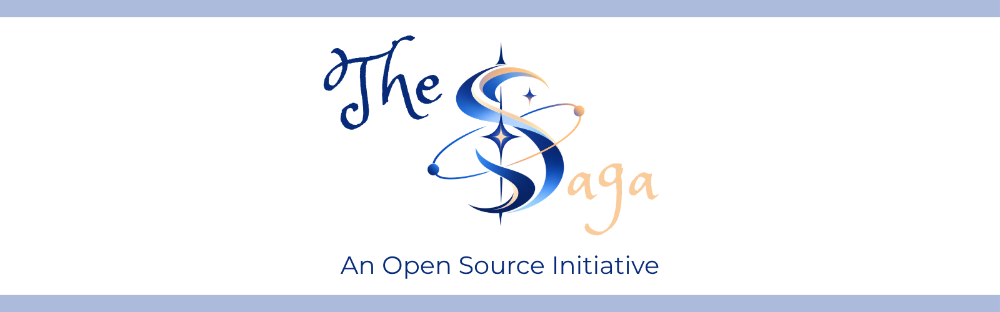

introduces

<h1>sorophyv2: Krono</h1>

<strong>A structured information and graph engine for building interconnected, temporal information.</strong>

Entities · Relationships · Typed Values · Graphs · Time · History · Evolution · Serialization

 

&nbsp;&nbsp;

&nbsp;&nbsp;

&nbsp;

<strong>🚧 2.0.0-beta.1 · Beta · Krono</strong> 

Krono is an active beta of the second-generation Sorophy architecture focused on temporal information, relationship evolution, historical state, and a stronger separation between information, behavior, and applications.

**---**

**### Build information into structure.**

Sorophy.Engine is the foundational engine of **The Saga**, a general-purpose structured information ecosystem designed to represent things, describe them, connect them, preserve their state, and reason about change without forcing every application to invent its own data model.

Version 1.0 established the stable graph foundation.

**sorophyv2: Krono** extends that foundation with a temporal and evolutionary model: relationships can carry explicit validity, evolve through declared operations, and preserve prior states as immutable history.

The result is not merely a larger graph library. It is a step toward an information engine in which **time and change are part of the model itself**.

> **Information has structure. Relationships have meaning. State can change. Time matters. History should not be silently erased.**

**---**

**# ✦ Table of Contents**

- [What Is Krono?](#-what-is-krono)

- [Krono Status](#-krono-status)

- [From V1 to Krono](#-from-v1-to-krono)

- [The Saga Vision](#-the-saga-vision)

- [Core Concepts](#-core-concepts)

- [Krono Entity Model](#-entity-model-20)

- [Krono Lore Model](#-lore-model-20)

- [The SorophyValue System](#-the-sorophyvalue-system)

- [Temporal Model](#-temporal-model)

- [Event Entities](#-event-entities)

- [Relationship Evolution](#-relationship-evolution)

- [Historical State](#-historical-state)

- [Current State vs Historical State](#-current-state-vs-historical-state)

- [Relationship Identity](#-relationship-identity)

- [Graph Operations](#-graph-operations)

- [Relationship Cascade](#-relationship-cascade)

- [Traversal and Reachability](#-traversal-and-reachability)

- [Serialization](#-serialization)

- [Storage](#-storage)

- [Architecture](#-architecture)

- [Canonical State and Derived State](#-canonical-state-and-derived-state)

- [Public API Philosophy](#-public-api-philosophy)

- [Validation and Reliability](#-validation-and-reliability)

- [Testing & Verification](#-testing--verification)

- [V1 Release Verification](#-v1-release-verification)

- [Potential Applications](#-potential-applications)

- [What Sorophy.Engine Is Not](#-what-sorophyengine-is-not)

- [Intended Ecosystem](#-intended-ecosystem)

- [Documentation](#-documentation)

- [Development](#-development)

- [Branch and Release Model](#-branch-and-release-model)

- [Design Principles](#-design-principles)

- [Roadmap](#-roadmap)

- [Beyond Krono](#-beyond-krono)

- [Contributing](#-contributing)

- [Community](#-community)

- [License](#-license)

- [The Philosophy](#-the-philosophy)

- [Author](#-author)

**---**

**# ✦ What Is Krono?**

**sorophyv2: Krono** is the second major architectural stage of Sorophy.Engine.

Krono keeps the small, explicit primitives that made the first engine useful:

\`\`\`text

SorophyValue

    ↓

SorophyProperty

    ↓

SorophyEntity

    ↓

SorophyRelationship

    ↓

SorophyGraph

\`\`\`

and extends them with another dimension:

\`\`\`text

                       Time

                        │

                        ▼

Entity ─────── Relationship ─────── Graph

                        │

                        ▼

                    Evolution

                        │

                        ▼

                     History

\`\`\`

The purpose is not to turn every object into a temporal database record.

The purpose is to make **meaningful temporal change representable without destroying the state that came before it**.

Krono therefore treats several concepts as distinct:

\`\`\`text

Entity

    = what exists

Relationship

    = how things are connected

Temporal Model

    = when a state is valid

Event

    = an entity that semantically represents an occurrence

Evolution

    = a declared state transition

Executor

    = the explicit mechanism that applies a transition

History

    = immutable record of prior relationship states

\`\`\`

**---**

**# ✦ Krono Status**

**## Current Beta**

\`2.0.0-beta.1\` is a **development beta**, not a stable Grade A release.

The current v2 checkpoint has:

\`\`\`text

469 / 469 deterministic unit tests passing

0 failed

0 skipped

\`\`\`

The Krono suite covers the implemented graph, entity, tag, temporal, history, relationship-evolution, and executor behavior represented by the current engine state.

The dedicated stress/release-gate campaign is intentionally **deferred until the remaining Krono architecture is sufficiently complete**.

This distinction matters.

A green unit suite means:

> The implemented behavior is currently passing its deterministic tests.

It does **not** mean:

> Every future Krono subsystem has been validated at release-gate scale.

That is why this release is \`beta.1\`.

**---**

**# ✦ From V1 to Krono**

V1 established the durable graph foundation.

\`\`\`text

V1.0.0

│

├── Entities

├── Relationships

├── Typed Values

├── Graph Storage

├── Traversal

├── Indexing

├── Serialization

├── Storage

└── Adversarial Verification

\`\`\`

Krono keeps those foundations and adds:

\`\`\`text

Krono

│

├── Krono Entity Model

├── Krono Lore Model

├── Semantic Time

├── Relationship Validity

├── Event Entity Semantics

├── Relationship Evolution

├── Historical Facts

├── Relationship History

└── Explicit Evolution Execution

\`\`\`

The conceptual shift is:

\`\`\`text

V1

"What exists?"

"How are things connected?"

Krono

"What exists?"

"How are things connected?"

"When is this state valid?"

"What changed?"

"When did it change?"

"What was true before?"

\`\`\`

V2 does not discard the graph model.

It gives the graph a memory.

**---**

**# ✦ The Saga Vision**

The Saga is not intended to be just a graph library.

**The Saga is an attempt to build a general-purpose structured information ecosystem.**

The fundamental idea is:

> **Information should be represented as structured, interconnected objects rather than being trapped inside isolated documents.**

Modern software gives us countless ways to create information, but much of that information remains fragmented across notes, files, databases, proprietary formats, applications, and prose.

A person may exist in one record.

A location may exist in another.

The relationship between them may exist only as a sentence in a third document.

The Saga approaches that problem from another direction.

Instead of beginning with documents, it begins with **structure**.

**---**

**## The Core Idea**

At the foundation of The Saga is the concept of an **entity**: something an information system needs to represent.

It could be:

\`\`\`text

Person

Location

Organization

Project

Concept

Historical Event

Scientific Object

Fictional Character

Machine

Document

Dataset

\`\`\`

Entities can carry properties and connect to one another:

\`\`\`text

┌───────────────┐

│    Person     │

│   Arannis     │

└───────┬───────┘

        │

      rules

        │

        ▼

┌───────────────┐

│   Kingdom     │

│   Asterra     │

└───────────────┘

\`\`\`

The important part is not merely that these objects exist.

**Their relationships are data too.**

Krono takes that one step further.

The relationship itself may have a state at a particular point in time, and the system may preserve what that state used to be.

**---**

**## From Documents to Structured Information**

Traditional documents are excellent for human-readable content.

They are less suitable when an application needs to answer structural questions such as:

\`\`\`text

Who is connected to this object?

What type of relationship connects them?

What properties does the relationship have?

When did this relationship become valid?

When did it stop being valid?

What was the previous state?

What changed?

\`\`\`

The Saga separates the underlying information model from the application that presents it.

\`\`\`text

                     THE SAGA

                       │

             ┌─────────┴─────────┐

             │                   │

      Structured Model       Applications

             │                   │

             │         ┌─────────┼─────────┐

             │         │         │         │

             ▼         ▼         ▼         ▼

         Entities   Orbpad    Editors   Other Tools

             │

             ▼

       Relationships

             │

             ▼

           Graph

\`\`\`

The engine becomes the foundation.

Applications become interfaces and specialized experiences built on top of it.

**---**

**## The Long-Term Goal**

\`\`\`text

┌─────────────────────┐

│     Application     │

└──────────┬──────────┘

           │

           ▼

┌─────────────────────┐

│    Sorophy.Engine       │

└──────────┬──────────┘

           │

           ▼

   Structured Information

           │

     ┌─────┼─────┐

     ▼     ▼     ▼

  Orbpad  Tool A Tool B

\`\`\`

The application is replaceable.

**The information is not.**

That is the direction The Saga is designed toward.

**---**

**# ✦ Core Concepts**

Sorophy.Engine revolves around a deliberately small number of primitives.

**## \`SorophyGraph\`**

\`SorophyGraph\` is the canonical owner of active graph state.

It maintains:

- Entities

- Relationships

- Connectivity

- Graph invariants

- Traversal structures

- Supporting indexes

- Relationship histories

Conceptually:

\`\`\`text

SorophyGraph

│

├── Entities

│   ├── Entity A

│   ├── Entity B

│   └── Entity C

│

├── Relationships

│   ├── A → B

│   ├── B → C

│   └── A → C

│

└── Relationship Histories

    ├── Relationship X

    └── Relationship Y

\`\`\`

The partial-class implementation is an organizational technique.

The public conceptual object remains one \`SorophyGraph\`.

**---**

**## \`SorophyEntity\`**

An entity is an independently identifiable object.

Its core identity is explicit, and its semantic classification is provided through its type.

Conceptually:

\`\`\`text

SorophyEntity

├── Identity

├── Name

├── Type

├── Description

├── Properties

├── Tags

└── Embedded Structured Content

\`\`\`

Entities do not need a graph to exist.

An application can create, inspect, serialize, or prepare an entity before placing it into a graph.

**---**

**## \`SorophyRelationship\`**

A relationship connects two entities.

It is a first-class object, not a sentence embedded inside another object.

Conceptually:

\`\`\`text

SorophyRelationship

├── Id

├── SourceId

├── TargetId

├── Type

├── Properties

├── ValidFrom

└── ValidTill

\`\`\`

This makes the relationship independently identifiable and independently evolvable.

**---**

**## \`SorophyProperty\`**

A property attaches structured information to an entity or relationship.

It consists of:

\`\`\`text

Name

Value

\`\`\`

The value is represented using \`SorophyValue\`, not an untyped string bag.

**---**

**# ✦ Krono Entity Model**

Krono Entity Model is an **expansion**, not a replacement, of the original entity concept.

The entity remains the smallest meaningful independently identifiable object in the Saga model.

See [\`docs/ENTITY_MODEL.md\`](docs/ENTITY_MODEL.md).

**## What Changed**

Krono Entity Model formalizes richer information around the entity:

\`\`\`text

Identity

Name

Type

Description

Properties

Tags

Embedded Structured Content

\`\`\`

The \`Type\` field remains a semantic classifier rather than a rigid inheritance tree.

Examples:

\`\`\`text

Character

Location

Organization

Project

Document

Dataset

Event

\`\`\`

Applications can define their own vocabulary without requiring a new engine subclass for every domain object.

**---**

**## Event Entities**

An event is still an \`SorophyEntity\`.

For example:

\`\`\`text

Name = "The Fall of Aranth"

Type = "Event"

\`\`\`

The engine provides event classification through \`IsEvent\`.

However:

> **\`Type = "Event"\` does not automatically execute evolution operations.**

That separation is intentional.

\`\`\`text

Event Entity

    ↓

represents an occurrence

Evolution Operation

    ↓

describes a state transition

Evolution Executor

    ↓

explicitly applies the transition

\`\`\`

There is deliberately no magical:

\`\`\`text

Set Type = Event

        ↓

Graph begins mutating

\`\`\`

mechanism.

**---**

**# ✦ Krono Lore Model**

Krono Lore Model represents the connected information model represented by \`.lore\` concepts and \`SorophyGraph\`.

See [\`docs/LORE_MODEL.md\`](docs/LORE_MODEL.md).

The v1 lore model was primarily a connected body of entities and relationships.

Krono retains that foundation but gives relationships a richer lifecycle:

\`\`\`text

Entity

   │

   ▼

Relationship

   │

   ├── Properties

   ├── Validity

   ├── Evolution

   └── History

\`\`\`

The conceptual distinction is:

\`\`\`text

Entity

"What is a thing?"

Lore

"How are things connected?"

Temporal Model

"When is a state valid?"

Evolution

"What changes the state?"

History

"What was true before?"

\`\`\`

A lore document therefore represents more than a collection of unrelated records.

It represents a connected information structure whose relationships can carry semantic state.

**---**

**# ✦ The SorophyValue System**

\`SorophyValue\` provides the engine's explicit typed-value model.

The existing value categories include:

\`\`\`text

Null

Boolean

Integer

Decimal

String

Guid

DateTime

List

Object

\`\`\`

The point is not to make the type system complicated.

The point is to prevent meaningful data from collapsing into arbitrary strings.

For example:

\`\`\`csharp

new SorophyValue(

    SorophyValueType.Integer,

    42L);

\`\`\`

is fundamentally different from:

\`\`\`csharp

new SorophyValue(

    SorophyValueType.String,

    "42");

\`\`\`

One represents an integer.

The other represents text.

That distinction matters to applications, serialization, validation, and future query systems.

**---**

**# ✦ Nested Values**

The Saga supports structured values inside lists and objects.

Conceptually:

\`\`\`text

Object

├── name = "Arannis"

├── age = 42

└── active = true

\`\`\`

and:

\`\`\`text

List

├── value 1

├── value 2

└── value 3

\`\`\`

Nested values are processed recursively by the serialization system.

The existing fidelity tests exercise nested values alongside important CLR types such as:

\`\`\`text

Guid

DateTime

Integer primitives

Floating-point CLR inputs

Decimal values

Nested Lists

Nested Objects

\`\`\`

The engine treats semantic preservation as more important than merely producing syntactically valid JSON.

**---**

**# ✦ Temporal Model**

Krono introduces an explicit temporal model centered around \`SorophyTime\`.

See [\`docs/TEMPORAL_MODEL.md\`](docs/TEMPORAL_MODEL.md).

The purpose is to avoid treating every world or domain timeline as if it were simply a wall-clock timestamp.

Instead:

\`\`\`text

SorophyTime

    │

    ├── Schema

    ├── Temporal Unit

    ├── Position

    └── Precision

\`\`\`

A temporal value belongs to a defined temporal schema.

This permits domains such as:

\`\`\`text

Year / Month / Day

Era / Age / Year

Phase / Cycle / Tick

Domain-specific temporal systems

\`\`\`

without forcing every application into one universal calendar.

**---**

**## Relationship Validity**

Relationships can carry explicit validity:

\`\`\`text

A ──[rules]──> B

ValidFrom = T1

ValidTill = T2

\`\`\`

This separates:

\`\`\`text

When the relationship state is valid

\`\`\`

from:

\`\`\`text

When the engine recorded a historical fact about that state

\`\`\`

Those concepts are not interchangeable.

**---**

**## Temporal Schema Consistency**

Temporal values used together must respect their schema boundaries.

Krono does not quietly pretend that two independently defined timelines are automatically compatible because both happen to contain a value called \`100\`.

Temporal semantics should be explicit.

**---**

**# ✦ Event Entities**

Events are intentionally modeled through the entity system instead of a special inheritance hierarchy.

\`\`\`text

SorophyEntity

Type = "Event"

\`\`\`

This gives applications the freedom to represent:

\`\`\`text

Battle

Treaty

Election

Birth

Death

Discovery

Migration

Corporate Event

Project Milestone

Simulation Event

\`\`\`

without forcing all of those domains into a single rigid taxonomy.

An event can therefore be treated as structured information while remaining connected to the rest of the graph.

The actual state transition, however, remains explicit.

**---**

**# ✦ Relationship Evolution**

Krono introduces explicit relationship evolution operations.

See [\`docs/EVENTS_AND_EVOLUTION.md\`](docs/EVENTS_AND_EVOLUTION.md).

The implemented operation family is:

\`\`\`text

Creation

Type Change

Property Modification

Validity Change

Termination

\`\`\`

The architecture separates **describing a transition** from **performing a transition**.

\`\`\`text

SorophyRelationshipEvolution

            │

            ▼

SorophyRelationshipEvolutionExecutor

            │

            ▼

        SorophyGraph

\`\`\`

An evolution object describes what should happen.

The executor is responsible for applying it.

**---**

**## Relationship Creation**

A creation operation introduces a new relationship identity:

\`\`\`text

A ──[new relation]──> B

\`\`\`

The creation operation can define:

\`\`\`text

Relationship ID

Source

Target

Type

Properties

Validity

Effective Time

\`\`\`

There is no prior state to snapshot because the relationship did not previously exist.

**---**

**## Type Change**

A type change modifies the active relationship's type.

Conceptually:

\`\`\`text

Before:

A ──knows──> B

Evolution @ T50

After:

A ──hates──> B

\`\`\`

The relationship ID remains the same.

Before mutation, the former state can be recorded as a historical fact.

\`\`\`text

History @ T50

    Type = knows

Current

    Type = hates

\`\`\`

**---**

**## Property Modification**

A property-modification operation can:

\`\`\`text

Set / Replace properties

Remove properties

\`\`\`

The previous relationship state can be captured first.

For example:

\`\`\`text

Before

Power = 100

Status = Active

Evolution

After

Power = 250

Status = Closed

\`\`\`

History preserves the previous state.

**---**

**## Validity Change**

A validity-change operation updates:

\`\`\`text

ValidFrom

ValidTill

\`\`\`

without turning the operation itself into a generic chronological engine.

Temporal compatibility is validated through the temporal model.

**---**

**## Termination**

Termination removes an active relationship from the canonical graph while preserving its historical identity.

Conceptually:

\`\`\`text

Active

   ↓

Terminate @ T100

   ↓

No longer active

   ↓

Relationship ID retired

\`\`\`

The prior state is captured before removal.

**---**

**# ✦ Historical State**

Krono introduces two distinct historical concepts:

\`\`\`text

SorophyRelationshipFact

SorophyRelationshipHistory

\`\`\`

See [\`docs/HISTORY.md\`](docs/HISTORY.md).

**## \`SorophyRelationshipFact\`**

A fact is an immutable representation of a relationship state at a particular temporal point.

Conceptually:

\`\`\`text

SorophyRelationshipFact

├── At

├── RelationshipId

├── SourceId

├── TargetId

├── Type

├── Properties

├── ValidFrom

└── ValidTill

\`\`\`

\`At\` answers:

> **At what temporal point was this historical state recorded?**

\`ValidFrom\` and \`ValidTill\` answer:

> **What validity interval belonged to that relationship state?**

These are deliberately separate.

**---**

**## \`SorophyRelationshipHistory\`**

A relationship history is an append-only sequence of facts belonging to one relationship identity.

\`\`\`text

Relationship X

    │

    └── History

         ├── Fact @ T1

         ├── Fact @ T2

         ├── Fact @ T3

         └── ...

\`\`\`

The history API intentionally does not provide replacement or deletion operations.

A historical fact is historical evidence.

It should not quietly change because the current relationship changed later.

**---**

**# ✦ Current State vs Historical State**

Krono makes this distinction explicit:

\`\`\`text

Current State

    = mutable

Historical State

    = append-only

Relationship Identity

    = persistent

\`\`\`

For example:

\`\`\`text

Year 10

A ──[Alliance]──> B

\`\`\`

At Year 50:

\`\`\`text

Alliance → Hostility

\`\`\`

The graph's active state becomes:

\`\`\`text

A ──[Hostility]──> B

\`\`\`

but history retains:

\`\`\`text

Fact @ Year 50

A ──[Alliance]──> B

\`\`\`

The mutation did not erase the previous state.

**---**

**# ✦ Relationship Identity**

Relationship identity is intentionally stronger in Krono.

A relationship is not merely a tuple that can disappear and be silently recreated under the same ID.

The intended lifecycle is:

\`\`\`text

Created

   ↓

Active

   ↓

Evolved

   ↓

Terminated

   ↓

Retired

\`\`\`

Once a relationship identity is retired, the engine rejects attempts to reuse it as a new active relationship.

This matters because identity is part of historical continuity.

Otherwise:

\`\`\`text

Relationship X dies

        ↓

Relationship X is recreated

        ↓

History cannot tell which X is which

\`\`\`

The entire purpose of historical identity would collapse.

**---**

**# ✦ Graph Operations**

The graph continues to provide explicit mutation and lookup operations.

**## Entity Operations**

Typical graph operations include:

\`\`\`csharp

graph.AddEntity(entity);

graph.RemoveEntity(entity.Id);

graph.ContainsEntity(entity.Id);

graph.TryGetEntity(

    entity.Id,

    out var result);

\`\`\`

**---**

**## Relationship Operations**

Typical relationship operations include:

\`\`\`csharp

graph.AddRelationship(relationship);

graph.RemoveRelationship(relationship.Id);

graph.ContainsRelationship(relationship.Id);

graph.TryGetRelationship(

    relationship.Id,

    out var result);

\`\`\`

The graph enforces referential integrity.

A relationship cannot be inserted against a missing source or target entity.

**---**

**# ✦ Relationship Cascade**

Removing an entity must not leave dangling relationships behind.

For example:

\`\`\`text

A ─────→ B

│

└──────→ C

\`\`\`

Removing \`A\` removes the connected active relationships.

The graph must not be left in a state where:

\`\`\`text

Relationship

    ├── Source → missing entity

    └── Target → existing entity

\`\`\`

This invariant is one of the foundational properties inherited from v1.

Historical data is a separate concern and is not treated as equivalent to active graph membership.

**---**

**# ✦ Traversal and Reachability**

Sorophy.Engine retains its graph traversal capabilities.

Traversal is used for:

\`\`\`text

Relationship navigation

Dependency exploration

Connected structures

Knowledge exploration

Worldbuilding queries

Graph-based application logic

\`\`\`

Reachability answers questions such as:

\`\`\`text

Can A reach D?

\`\`\`

in:

\`\`\`text

A → B → C → D

\`\`\`

Traversal remains an engine concern.

A higher-level query system can later build richer semantics on top of it.

**---**

**# ✦ Serialization**

Sorophy.Engine has dedicated serialization concepts for its document models.

**## \`.entity\`**

Represents an independently identifiable entity.

\`\`\`text

SorophyEntity

    ↓

EntitySerializer

    ↓

.entity representation

\`\`\`

**## \`.lore\`**

Represents a connected body of entities and relationships.

\`\`\`text

SorophyGraph

    ↓

LoreSerializer

    ↓

.lore representation

\`\`\`

See [\`docs/SERIALIZATION.md\`](docs/SERIALIZATION.md).

**---**

**## Serialization Direction**

Krono adds semantic state that future persistence layers need to preserve:

\`\`\`text

SorophyTime

Relationship Validity

Historical Facts

Relationship History

Evolution Data

\`\`\`

The project intentionally distinguishes between:

\`\`\`text

Feature exists in memory

\`\`\`

and:

\`\`\`text

Feature has a finalized stable persistence contract

\`\`\`

serialization hardening remains part of the roadmap.

**---**

**## Deserialization Does Not Execute Evolution**

This rule is important.

\`\`\`text

Deserialize

    ≠

Execute

\`\`\`

If an evolution operation is ever persisted, loading it must reconstruct data.

It must not silently mutate a graph as a side effect of reading a file.

Execution remains an explicit operation.

**---**

**# ✦ Storage**

The storage layer remains separated from graph logic and serialization mechanics.

Conceptually:

\`\`\`text

Application

    ↓

Storage

    ↓

Serialization

    ↓

Structured Model

\`\`\`

This separation allows the persistence mechanism to evolve without redefining the information model.

The engine is not intended to force every application into one storage backend.

**---**

**# ✦ Architecture**

The high-level Krono architecture is:

\`\`\`text

┌─────────────────────────────────────────────┐

│                  Applications               │

│       Orbpad · Editors · Domain Tools       │

└──────────────────────┬──────────────────────┘

                       │

                       ▼

┌─────────────────────────────────────────────┐

│                 Sorophy.Engine                  │

│                                             │

│ Entity · Graph · Relationship · Properties  │

│ Typed Values · Tags · Time · Evolution      │

│ History · Validation                        │

└───────────────┬───────────────┬─────────────┘

                │               │

                ▼               ▼

        Serialization         Storage

                │               │

                └───────┬───────┘

                        ▼

                .entity / .lore

\`\`\`

The intended dependency direction is:

\`\`\`text

Application

    ↓

Sorophy.Engine

    ↓

Structured Information

\`\`\`

not:

\`\`\`text

Sorophy.Engine

    ↓

Orbpad-specific behavior

\`\`\`

The engine owns the model.

Applications own the experience.

**---**

**# ✦ Canonical State and Derived State**

Krono deliberately distinguishes authoritative state from supporting structures.

**## Canonical**

\`\`\`text

Entities

Relationships

Relationship Histories

\`\`\`

**## Derived / Supporting**

\`\`\`text

Tag Index

Relationship Indexes

Adjacency Storage

\`\`\`

The rule is:

> **Derived structures exist to make access efficient. They must agree with canonical state, but they must not quietly become the source of truth.**

This separation is especially important as temporal and historical systems become more sophisticated.

**---**

**# ✦ Public API Philosophy**

Sorophy.Engine is intended to expose a small, understandable public surface.

The public API should revolve around semantic concepts rather than internal implementation details.

Examples include:

\`\`\`text

SorophyGraph

SorophyEntity

SorophyRelationship

SorophyProperty

SorophyValue

SorophyValueType

SorophyTime

SorophyTimeSchema

SorophyRelationshipFact

SorophyRelationshipHistory

SorophyRelationshipEvolution

SorophyRelationshipEvolutionExecutor

\`\`\`

The exact public surface is defined by implementation and API tests.

The engine should resist turning every helper type into a public contract merely because an implementation happens to use it.

**---**

**# ✦ Validation and Reliability**

Sorophy.Engine was designed around an adversarial testing philosophy.

The important question is not:

> "Does \`A → B\` work?"

The important question is:

> **"What happens when someone does something inconvenient?"**

That means the engine tests things such as:

\`\`\`text

Missing entities

Invalid relationships

Duplicate identifiers

Failed mutations

Relationship deletion

Stale references

Index consistency

Temporal incompatibility

Historical ownership

Evolution failures

Malformed serialization

Unexpected values

\`\`\`

A stateful graph system must be designed around failure behavior, not merely its happy path.

**---**

**# ✦ Testing & Verification**

The current deterministic v2 checkpoint is:

**### 🧪 469 / 469 tests passing**

**0 failed · 0 skipped**

&nbsp;&nbsp;

The suite currently establishes the deterministic behavior of the implemented Krono scope.

**## Evolution Verification**

The evolution tests cover:

\`\`\`text

Creation

Type Change

Property Modification

Validity Change

Termination

\`\`\`

and also test sequences such as:

\`\`\`text

Create → Type Change

Type Change → Property Change → Termination

Repeated Property Changes

Termination → Attempted Identity Reuse

\`\`\`

**## Historical Verification**

History tests cover:

\`\`\`text

Fact ownership

Append-only behavior

Insertion order

Duplicate fact rejection

History retention after relationship removal

Retired relationship identity

Snapshot preservation

\`\`\`

**## Temporal Verification**

Temporal tests cover:

\`\`\`text

Temporal schema consistency

ValidFrom

ValidTill

At

Compatible temporal values

Incompatible temporal values

\`\`\`

**## Why The V2 Stress Campaign Is Deferred**

The repository already contains a mature stress-test arsenal.

The v1 release-gate program established large-scale evidence for the original engine foundation.

However, Krono adds semantics that require a dedicated Krono verification boundary.

The planned sequence is:

\`\`\`text

Finish Krono architecture

        ↓

Finish V2 deterministic tests

        ↓

Finish V2 documentation

        ↓

Run dedicated stress program

        ↓

Evaluate beta / release readiness

\`\`\`

The old stress program is useful evidence and a useful tool.

It is not being mislabeled as the final Krono release gate.

**---**

**# ✦ V1 Release Verification**

Sorophy.Engine 1.0.0 remains the stable historical release of the first-generation engine.

It was released as:

\`\`\`text

Version: 1.0.0

Grade:   A — Silver Standard

Status:  Stable

\`\`\`

The V1 release verification program included:

\`\`\`text

12 campaigns

49 checks

0 failures

\`\`\`

with workloads covering mutation, replay, performance, allocation reuse, high-degree topology, relationship scaling, memory, differential fuzzing, serialization torture, crash/recovery, and soak/endurance.

The V1 release record remains important because Krono is built on that foundation.

However:

> **V1 verification is evidence for V1. It is not automatically evidence for every Krono feature.**

The historical V1 release material remains preserved in the release documentation and project history.

**---**

**# ✦ Potential Applications**

The following are **possible domains**, not claims that Sorophy.Engine is already a complete end-to-end solution for each one.

**## Worldbuilding and Fiction**

Krono is naturally suited to structured fictional worlds.

It can represent:

\`\`\`text

Characters

Factions

Locations

Kingdoms

Organizations

Events

Treaties

Wars

Family structures

Historical relationships

Temporal changes

\`\`\`

A relationship can stop being merely:

\`\`\`text

A ──rules──> B

\`\`\`

and become a state that evolves through a timeline.

**---**

**## Knowledge Management**

A structured knowledge system can represent:

\`\`\`text

Concepts

People

Organizations

Documents

Projects

Dependencies

Topics

References

\`\`\`

while keeping explicit relationships instead of burying every connection inside prose.

The long-term value is not merely storing more notes.

It is making the relationships between the notes explicit.

**---**

**## Research and Scientific Information**

Potential representations include:

\`\`\`text

Projects

Samples

Datasets

Instruments

Experiments

Observations

Publications

Dependencies

\`\`\`

Temporal semantics can be useful where the question is not just:

\`\`\`text

What is this?

\`\`\`

but:

\`\`\`text

When was this state valid?

What changed?

What was the previous state?

\`\`\`

**---**

**## Historical and Archival Systems**

Historical information is one of the strongest conceptual fits for Krono.

A conventional record may answer:

\`\`\`text

Who is the ruler?

\`\`\`

A temporal model can support questions such as:

\`\`\`text

Who was the ruler in Year 400?

When did the relationship change?

What was true before the change?

What relationship existed between these entities at a particular point?

\`\`\`

Krono is not itself a complete archival product, but its relationship-history architecture is designed around this class of problem.

**---**

**## Project and Organizational Systems**

Potential objects include:

\`\`\`text

People

Teams

Projects

Responsibilities

Artifacts

Dependencies

Milestones

Events

\`\`\`

Relationship evolution can model organizational changes without requiring the current state to erase its former structure.

**---**

**## Games and Simulations**

A simulation can naturally produce:

\`\`\`text

Entities

Events

Relationship changes

State transitions

Historical state

Temporal validity

\`\`\`

The engine can provide structured state semantics while the simulation itself remains an application concern.

**---**

**## Structured Documentation**

Technical systems often have entities and dependencies:

\`\`\`text

Component

Service

Module

Owner

Dependency

Deployment

Version

\`\`\`

Krono makes it possible to model those relationships explicitly and, eventually, reason about how they change over time.

**---**

**# ✦ What Sorophy.Engine Is Not**

Sorophy.Engine is intentionally **not**:

- A graphical editor

- A complete worldbuilding application

- A database server

- A cloud platform

- A UI framework

- A game engine

- A replacement for every relational database

- A general-purpose ORM

- An AI assistant

It is a:

> **Core structured-information and graph engine.**

Higher-level applications should build on top of it rather than forcing the engine to become every possible application.

**---**

**# ✦ Intended Ecosystem**

The Saga is being developed as an ecosystem rather than a single monolithic application.

\`\`\`text

                     THE SAGA

                       │

             ┌─────────┴─────────┐

             │                   │

         Sorophy.Engine          Applications

             │                   │

             │          ┌────────┼────────┐

             │          │        │        │

             ▼          ▼        ▼        ▼

      Structured Data  Orbpad   Tools   Future Apps

\`\`\`

Orbpad is intended to be one major consumer of the engine.

It does not need to own:

\`\`\`text

Graph implementation

Relationship lifecycle

Temporal model

History system

Typed-value system

\`\`\`

The engine provides those primitives.

The application provides the human experience.

**---**

**# ✦ Documentation**

Krono documentation is split by concern.

\| Document | Purpose |

\|---|---|

\| [\`ARCHITECTURE.md\`](docs/ARCHITECTURE.md) | Engine boundaries and major subsystems |

\| [\`ENTITY_MODEL.md\`](docs/ENTITY_MODEL.md) | Krono Entity Model |

\| [\`LORE_MODEL.md\`](docs/LORE_MODEL.md) | Krono Lore Model and relationship semantics |

\| [\`TEMPORAL_MODEL.md\`](docs/TEMPORAL_MODEL.md) | \`SorophyTime\`, schemas, validity, and temporal rules |

\| [\`EVENTS_AND_EVOLUTION.md\`](docs/EVENTS_AND_EVOLUTION.md) | Event semantics and relationship evolution |

\| [\`HISTORY.md\`](docs/HISTORY.md) | Historical facts and relationship history |

\| [\`SERIALIZATION.md\`](docs/SERIALIZATION.md) | Serialization direction and persistence semantics |

\| [\`TESTING.md\`](docs/TESTING.md) | testing philosophy and verification status |

\| [\`ROADMAP.md\`](docs/ROADMAP.md) | Current roadmap, priorities, and deferred ideas |

**---**

**# ✦ Development**

Clone the repository:

\`\`\`bash

git clone https://github.com/Phantom-Con-Artist/Sorophy.git

cd Sorophy

\`\`\`

Switch to the Krono development line:

\`\`\`bash

git switch v2-beta

\`\`\`

Build:

\`\`\`bash

dotnet build

\`\`\`

Run the complete deterministic unit suite:

\`\`\`bash

dotnet test

\`\`\`

Inspect the stress-test arsenal:

\`\`\`bash

dotnet run --project Sorophy.Engine.StressTests -- list

\`\`\`

Build Release:

\`\`\`bash

dotnet build -c Release

\`\`\`

Create the NuGet package:

\`\`\`bash

dotnet pack -c Release

\`\`\`

The dedicated stress/release-gate run will occur after the remaining Krono architecture is complete.

**---**

**# ✦ Branch and Release Model**

The repository deliberately separates the stable V1 line from Krono development.

\`\`\`text

v1-stable

    │

    └── V1.0.0 stable line

v2-beta

    │

    └── sorophyv2: Krono

\`\`\`

The release tag:

\`\`\`text

v1.0.0

\`\`\`

identifies the historical V1 release.

The current Krono development line is:

\`\`\`text

v2-beta

\`\`\`

with the current beta checkpoint:

\`\`\`text

2.0.0-beta.1

\`\`\`

This keeps stable V1 maintenance conceptually separate from the evolving Krono architecture.

**---**

**# ✦ Design Principles**

**## 1. Structure over convenience**

Data should retain meaning instead of being converted to strings simply because strings are easy.

**## 2. Explicit invariants**

Invalid graph state should be prevented or rejected rather than silently tolerated.

**## 3. Temporal semantics are first-class**

When time changes the meaning of information, time should be represented explicitly.

**## 4. History is not mutation**

Current state may change.

Historical facts remain append-only.

**## 5. Explicit execution**

Declarative state transitions should not mutate the graph merely because they exist.

**## 6. Applications do not own the engine**

Sorophy.Engine should remain reusable by applications with very different purposes.

**## 7. Derived structures are not truth**

Indexes and acceleration structures support canonical state.

They do not replace it.

**## 8. Round-trip fidelity**

Serialization should preserve semantic information.

**## 9. Small public API**

Implementation details should remain implementation details.

**## 10. Test the ugly cases**

A graph engine is not trustworthy merely because the happy path works.

The inconvenient cases are where the real architecture reveals itself.

**---**

**# ✦ Roadmap**

Krono is being developed incrementally.

The current roadmap distinguishes implemented foundations from work that remains.

**## ✅ Completed**

\`\`\`text

Core Graph

Entity storage

Relationship storage

Referential integrity

Adjacency management

Relationship indexing

Tag indexing

Traversal

Reachability

Relationship identity retirement

Krono Entity Model

Description

Tags

Embedded structured content

Event classification

Temporal Model

SorophyTime

Temporal schemas

Temporal units

Position definitions

Precision

Relationship validity

Temporal consistency

History

SorophyRelationshipFact

SorophyRelationshipHistory

Graph-level history storage

Append-only recording

Historical state capture

Retired relationship identities

Relationship Evolution

Creation

Type Change

Property Modification

Validity Change

Termination

SorophyRelationshipEvolutionExecutor

Verification

469 / 469 deterministic unit tests passing

\`\`\`

**---**

**## 🚧 Next: Temporal Projection**

**### 1. Graph Snapshot**

Build a stable read-only representation of graph state at a selected temporal point.

Conceptually:

\`\`\`text

SorophyGraph

    ↓

CreateSnapshot(T)

    ↓

SorophyGraphSnapshot

\`\`\`

The intended snapshot should be:

\`\`\`text

Read-only

Materialized

Stable after creation

Independent of later live-graph mutation

\`\`\`

This is the planned foundation for temporal read models.

**---**

**## 🚧 Query Layer**

Higher-level read operations can eventually provide:

\`\`\`text

Entity lookup

Relationship lookup

Type filtering

Tag filtering

Neighbor queries

Relationship filtering

Temporal lookup

Historical lookup

\`\`\`

The query layer should consume the model rather than redefine it.

**---**

**## 🚧 Temporal Queries**

Potential questions include:

\`\`\`text

What relationships existed at T?

What was the state of relationship X at T?

What facts surround T?

What changed between T1 and T2?

\`\`\`

This is where Krono's temporal foundation becomes directly useful to applications.

**---**

**## 🚧 Graph Diff / Change Sets**

Compare two snapshots or temporal projections:

\`\`\`text

Snapshot(T1)

      ↓

     Diff

      ↓

Snapshot(T2)

\`\`\`

Potential outputs:

\`\`\`text

Added entities

Removed entities

Changed entities

Added relationships

Removed relationships

Changed relationships

\`\`\`

**---**

**## 🚧 Validation Hardening**

As subsystems multiply, validation should increasingly reason across:

\`\`\`text

Graph invariants

Index invariants

Temporal invariants

History invariants

Evolution invariants

Serialization invariants

\`\`\`

The goal is an engine capable of detecting internal disagreement, not merely handling valid API calls.

**---**

**## 🚧 Serialization Hardening**

Expand explicit verification around:

\`\`\`text

Temporal values

Relationship validity

Historical facts

Relationship histories

Evolution data

Compatibility

Migration

Deterministic output

Large documents

\`\`\`

**---**

**## 🚧 Cross-Platform Hardening**

Keep Sorophy.Engine platform-neutral as a reusable .NET foundation.

UI and operating-system-specific concerns belong above the engine boundary.

**---**

**## 🚧 Dedicated Stress Program**

After the major Krono architecture stabilizes, run a dedicated stress/release-gate campaign.

The goal is to test not only the old graph foundation but the new:

\`\`\`text

Time

Evolution

History

Temporal Projection

\`\`\`

semantics under adversarial workloads.

**---**

**# ✦ Explicitly Deferred**

**## EventPkg**

**Not required for v2.**

Krono already has:

\`\`\`text

Event Entity

Evolution Operations

Evolution Executor

\`\`\`

Introducing another orchestration wrapper would add complexity without solving a current Krono requirement.

EventPkg remains a possible future abstraction.

**---**

**## Whimsy / NLP**

Whimsy is intentionally deferred until the structured-information substrate is mature.

The intended direction is:

\`\`\`text

Sorophy.Engine

    ↓

Stable semantic model

    ↓

Whimsy

    ↓

Natural-language interaction

\`\`\`

not the reverse.

**---**

**## Application-Specific UI**

Sorophy.Engine remains UI-agnostic.

Editors, graph viewers, timeline interfaces, and domain workflows belong to application layers.

**---**

**# ✦ Beyond Krono**

Potential post-Krono directions include:

\`\`\`text

Event orchestration packages

State reconstruction

Replay

Advanced temporal analysis

Advanced graph algorithms

Domain adapters

Natural-language querying

Broader Saga ecosystem services

\`\`\`

These are possibilities, not promises.

The project should not accumulate architecture simply because a future feature can be imagined.

**---**

**# ✦ The Completion Philosophy**

Krono should be considered complete when the engine can reliably:

\`\`\`text

Represent structured information

        ↓

Connect that information

        ↓

Represent meaningful temporal state

        ↓

Apply explicit state transitions

        ↓

Preserve historical relationship state

        ↓

Allow applications to query the resulting model

\`\`\`

The goal is not maximum feature count.

The goal is a **coherent engine whose features reinforce one another**.

A hundred unrelated conveniences are not an architecture.

A few strong primitives that work together are.

**---**

**# ✦ Contributing**

Contributions, ideas, bug reports, and technical discussion are welcome.

Before proposing major architectural changes, establish the intended design before implementing it.

For bug reports, include:

\`\`\`text

Sorophy.Engine version

.NET version

Operating system

Minimal reproduction

Expected behavior

Actual behavior

Relevant exception or test output

\`\`\`

For architecture changes, explain:

\`\`\`text

What problem is being solved?

Why does it belong in the engine?

Which existing invariant or boundary does it affect?

What should remain deliberately out of scope?

\`\`\`

**---**

**# ✦ Community**

Questions, design discussion, and community support happen on Discord.

Formal defects and architectural proposals should still be tracked through the repository issue/discussion workflow where appropriate.

**---**

**# ✦ License**

Sorophy.Engine is released under the **GNU Affero General Public License v3.0 or later (AGPL-3.0-or-later)**.

See [\`LICENSE\`](LICENSE) for the authoritative license text.

Repository branding, logos, badges, and other visual assets may be subject to separate terms where explicitly stated.

Their presence does not change the software license of Sorophy.Engine.

**---**

**# ✦ The Philosophy**

The Saga ultimately follows one principle:

**### **Don't build another place to store information.****

**### **Build a system that understands what the information is.****

Krono extends that philosophy:

**### **Don't let change destroy meaning.****

**### **Represent the state, represent the transition, preserve the history.****

The engine is not trying to predict every future application.

It is trying to provide a foundation strong enough that future applications do not have to rebuild the same concepts from scratch.

\`\`\`text

Structure

    ↓

Relationships

    ↓

Time

    ↓

Change

    ↓

History

    ↓

Understanding

\`\`\`

That is what Krono is for.

The ecosystem comes later.

**The foundation comes first.**

**---**

**# ✦ Author**

<h2>Subhradeep Sarkar</h2>

Creator and maintainer of Sorophy Engine

&nbsp;

&nbsp;

&nbsp;

**---**

 

<strong>sorophyv2: Krono</strong>

 

Structured information. Connected by design. Aware of change.

  

© 2026 <strong>Subhradeep Sarkar</strong>. Sorophy.Engine is licensed under the GNU Affero General Public License v3.0 or later. See \`LICENSE\` for the authoritative license text.

