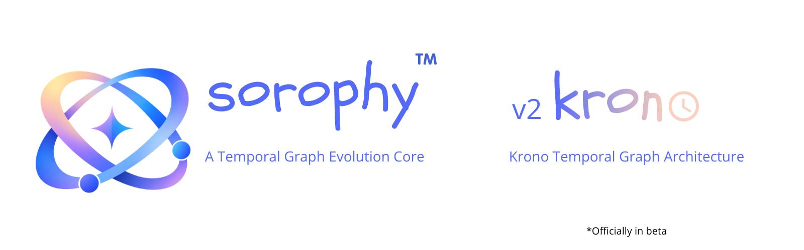

<div align="center">


<p>introduces</p>



<h1>Sorophy v2.0.0-beta.1: Krono</h1>

<p>
<strong>A structured information and graph engine for building interconnected, temporal information.</strong>
</p>

<p>
Entities · Relationships · Typed Values · Graphs · Time · History · Evolution · Serialization
</p>

<br/>

<p align="center">
  <a href="https://github.com/Phantom-Con-Artist/Sorophy"></a>&nbsp;
  <a href="https://github.com/Phantom-Con-Artist/Sorophy/releases"></a>&nbsp;
  <a href="LICENSE"></a>
</p>

<p align="center">
  <a href="https://dotnet.microsoft.com/"></a>&nbsp;
  <a href="https://learn.microsoft.com/en-us/dotnet/csharp/"></a>&nbsp;
  <a href="CHANGELOG.md"></a>
</p>

<p align="center">
  <a href="https://discord.com/invite/Em2ur4J8PF"></a>&nbsp;
  <a href="mailto:personalsarkar345@gmail.com"></a>
</p>

<p>
<strong>🚧 2.0.0-beta.1 · Beta · Krono</strong><br/>
Krono is an active beta of the second-generation Sorophy architecture focused on temporal information, relationship evolution, historical state, and a stronger separation between information, behavior, and applications.
</p>

</div>

---

<div align="center">

### Build information into structure.

</div>

Sorophy.Engine is the foundational engine of **The Saga**, a general-purpose structured information ecosystem designed to represent things, describe them, connect them, preserve their state, and reason about change without forcing every application to invent its own data model.

Version 1.0 established the stable graph foundation.

**Sorophy v2.0.0-beta.1: Krono** extends that foundation with a temporal and evolutionary model: relationships can carry explicit validity, evolve through declared operations, and preserve prior states as immutable history.

The result is not merely a larger graph library. It is a step toward an information engine in which **time and change are part of the model itself**.

> **Information has structure. Relationships have meaning. State can change. Time matters. History should not be silently erased.**

---

# ✦ Table of Contents

- [What Is Krono?](#-what-is-krono)
- [Krono Status](#-krono-status)
- [From V1 to Krono](#-from-v1-to-krono)
- [The Saga Vision](#-the-saga-vision)
- [Core Concepts](#-core-concepts)
- [Krono Entity Model](#-entity-model-20)
- [Krono Lore Model](#-lore-model-20)
- [The SorophyValue System](#-the-sorophyvalue-system)
- [Temporal Model](#-temporal-model)
- [Event Entities](#-event-entities)
- [Relationship Evolution](#-relationship-evolution)
- [Historical State](#-historical-state)
- [Current State vs Historical State](#-current-state-vs-historical-state)
- [Relationship Identity](#-relationship-identity)
- [Graph Operations](#-graph-operations)
- [Relationship Cascade](#-relationship-cascade)
- [Traversal and Reachability](#-traversal-and-reachability)
- [Serialization](#-serialization)
- [Storage](#-storage)
- [Architecture](#-architecture)
- [Canonical State and Derived State](#-canonical-state-and-derived-state)
- [Public API Philosophy](#-public-api-philosophy)
- [Validation and Reliability](#-validation-and-reliability)
- [Testing & Verification](#-testing--verification)
- [V1 Release Verification](#-v1-release-verification)
- [Potential Applications](#-potential-applications)
- [What Sorophy.Engine Is Not](#-what-sorophyengine-is-not)
- [Intended Ecosystem](#-intended-ecosystem)
- [Documentation](#-documentation)
- [Development](#-development)
- [Branch and Release Model](#-branch-and-release-model)
- [Design Principles](#-design-principles)
- [Roadmap](#-roadmap)
- [Beyond Krono](#-beyond-krono)
- [Contributing](#-contributing)
- [Community](#-community)
- [License](#-license)
- [The Philosophy](#-the-philosophy)
- [Author](#-author)

---

# ✦ What Is Krono?

**Sorophy v2.0.0-beta.1: Krono** is the second major architectural stage of Sorophy.Engine.

Krono keeps the small, explicit primitives that made the first engine useful:

```text
SorophyValue
    ↓
SorophyProperty
    ↓
SorophyEntity
    ↓
SorophyRelationship
    ↓
SorophyGraph
```

and extends them with another dimension:

```text
                        Time
                         │
                         ▼
Entity ─────── Relationship ─────── Graph
                         │
                         ▼
                     Evolution
                         │
                         ▼
                      History
```

The purpose is not to turn every object into a temporal database record.

The purpose is to make **meaningful temporal change representable without destroying the state that came before it**.

Krono therefore treats several concepts as distinct:

```text
Entity
    = what exists

Relationship
    = how things are connected

Temporal Model
    = when a state is valid

Event
    = an entity that semantically represents an occurrence

Evolution
    = a declared state transition

Executor
    = the explicit mechanism that applies a transition

History
    = immutable record of prior relationship states
```

---

# ✦ Krono Status

## Current Beta

`2.0.0-beta.1` is a **development beta**, not a stable Grade A release.

The current v2 checkpoint has:

```text
469 / 469 deterministic unit tests passing
0 failed
0 skipped
```

The Krono suite covers the implemented graph, entity, tag, temporal, history, relationship-evolution, and executor behavior represented by the current engine state.

The dedicated stress/release-gate campaign is intentionally **deferred until the remaining Krono architecture is sufficiently complete**.

This distinction matters.

A green unit suite means:
> The implemented behavior is currently passing its deterministic tests.

It does **not** mean:
> Every future Krono subsystem has been validated at release-gate scale.

That is why this release is `beta.1`.

---

# ✦ From V1 to Krono

V1 established the durable graph foundation.

```text
V1.0.0
│
├── Entities
├── Relationships
├── Typed Values
├── Graph Storage
├── Traversal
├── Indexing
├── Serialization
├── Storage
└── Adversarial Verification
```

Krono keeps those foundations and adds:

```text
Krono
│
├── Krono Entity Model
├── Krono Lore Model
├── Semantic Time
├── Relationship Validity
├── Event Entity Semantics
├── Relationship Evolution
├── Historical Facts
├── Relationship History
└── Explicit Evolution Execution
```

The conceptual shift is:

```text
V1
"What exists?"
"How are things connected?"

Krono
"What exists?"
"How are things connected?"
"When is this state valid?"
"What changed?"
"When did it change?"
"What was true before?"
```

V2 does not discard the graph model. It gives the graph a memory.

---

# ✦ The Saga Vision

The Saga is not intended to be just a graph library.

**The Saga is an attempt to build a general-purpose structured information ecosystem.**

The fundamental idea is:

> **Information should be represented as structured, interconnected objects rather than being trapped inside isolated documents.**

Modern software gives us countless ways to create information, but much of that information remains fragmented across notes, files, databases, proprietary formats, applications, and prose.

A person may exist in one record.  
A location may exist in another.  
The relationship between them may exist only as a sentence in a third document.

The Saga approaches that problem from another direction.  
Instead of beginning with documents, it begins with **structure**.

---

## The Core Idea

At the foundation of The Saga is the concept of an **entity**: something an information system needs to represent.

It could be:

```text
Person
Location
Organization
Project
Concept
Historical Event
Scientific Object
Fictional Character
Machine
Document
Dataset
```

Entities can carry properties and connect to one another:

```text
┌───────────────┐
│     Person    │
│    Arannis    │
└───────┬───────┘
        │
      rules
        │
        ▼
┌───────────────┐
│    Kingdom    │
│    Asterra    │
└───────────────┘
```

The important part is not merely that these objects exist. **Their relationships are data too.**

Krono takes that one step further: the relationship itself may have a state at a particular point in time, and the system preserves what that state used to be.

---

## From Documents to Structured Information

Traditional documents are excellent for human-readable content.

They are less suitable when an application needs to answer structural questions such as:

```text
Who is connected to this object?
What type of relationship connects them?
What properties does the relationship have?
When did this relationship become valid?
When did it stop being valid?
What was the previous state?
What changed?
```

The Saga separates the underlying information model from the application that presents it:

```text
                     THE SAGA
                        │
              ┌─────────┴─────────┐
              │                   │
      Structured Model        Applications
              │                   │
              │         ┌─────────┼─────────┐
              │         │         │         │
              ▼         ▼         ▼         ▼
          Entities   Orbpad    Editors   Other Tools
              │
              ▼
        Relationships
              │
              ▼
            Graph
```

The engine becomes the foundation. Applications become interfaces and specialized experiences built on top of it.

---

## The Long-Term Goal

```text
┌─────────────────────┐
│     Application     │
└──────────┬──────────┘
           │
           ▼
┌─────────────────────┐
│    Sorophy.Engine   │
└──────────┬──────────┘
           │
           ▼
   Structured Information
           │
     ┌─────┼─────┐
     ▼     ▼     ▼
  Orbpad  Tool A Tool B
```

The application is replaceable. **The information is not.**

That is the direction The Saga is designed toward.

---

# ✦ Core Concepts

Sorophy.Engine revolves around a deliberately small number of primitives.

## `SorophyGraph`

`SorophyGraph` is the canonical owner of active graph state.

It maintains:
- Entities
- Relationships
- Connectivity
- Graph invariants
- Traversal structures
- Supporting indexes
- Relationship histories

Conceptually:

```text
SorophyGraph
│
├── Entities
│   ├── Entity A
│   ├── Entity B
│   └── Entity C
│
├── Relationships
│   ├── A → B
│   ├── B → C
│   └── A → C
│
└── Relationship Histories
    ├── Relationship X
    └── Relationship Y
```

The partial-class implementation is an organizational technique. The public conceptual object remains one `SorophyGraph`.

---

## `SorophyEntity`

An entity is an independently identifiable object.

Its core identity is explicit, and its semantic classification is provided through its type.

Conceptually:

```text
SorophyEntity
├── Identity
├── Name
├── Type
├── Description
├── Properties
├── Tags
└── Embedded Structured Content
```

Entities do not need a graph to exist. An application can create, inspect, serialize, or prepare an entity before placing it into a graph.

---

## `SorophyRelationship`

A relationship connects two entities. It is a first-class object, not a sentence embedded inside another object.

Conceptually:

```text
SorophyRelationship
├── Id
├── SourceId
├── TargetId
├── Type
├── Properties
├── ValidFrom
└── ValidTill
```

This makes the relationship independently identifiable and independently evolvable.

---

## `SorophyProperty`

A property attaches structured information to an entity or relationship.

It consists of:

```text
Name
Value
```

The value is represented using `SorophyValue`, not an untyped string bag.

---

# ✦ Krono Entity Model

Krono Entity Model is an **expansion**, not a replacement, of the original entity concept.

The entity remains the smallest meaningful independently identifiable object in the Saga model. See [`docs/ENTITY_MODEL.md`](docs/ENTITY_MODEL.md).

## What Changed

Krono Entity Model formalizes richer information around the entity:

```text
Identity
Name
Type
Description
Properties
Tags
Embedded Structured Content
```

The `Type` field remains a semantic classifier rather than a rigid inheritance tree:

```text
Character
Location
Organization
Project
Document
Dataset
Event
```

Applications can define their own vocabulary without requiring a new engine subclass for every domain object.

---

## Event Entities

An event is still a `SorophyEntity`. For example:

```text
Name = "The Fall of Aranth"
Type = "Event"
```

The engine provides event classification through `IsEvent`.

However:
> **`Type = "Event"` does not automatically execute evolution operations.**

That separation is intentional:

```text
Event Entity
    ↓
represents an occurrence

Evolution Operation
    ↓
describes a state transition

Evolution Executor
    ↓
explicitly applies the transition
```

There is deliberately no magical trigger where setting `Type = Event` immediately begins mutating the graph.

---

# ✦ Krono Lore Model

Krono Lore Model represents the connected information model represented by `.lore` concepts and `SorophyGraph`. See [`docs/LORE_MODEL.md`](docs/LORE_MODEL.md).

The v1 lore model was primarily a connected body of entities and relationships. Krono retains that foundation but gives relationships a richer lifecycle:

```text
Entity
   │
   ▼
Relationship
   │
   ├── Properties
   ├── Validity
   ├── Evolution
   └── History
```

The conceptual distinction is:

```text
Entity
"What is a thing?"

Lore
"How are things connected?"

Temporal Model
"When is a state valid?"

Evolution
"What changes the state?"

History
"What was true before?"
```

A lore document represents more than a collection of unrelated records: it represents a connected information structure whose relationships can carry semantic state.

---

# ✦ The SorophyValue System

`SorophyValue` provides the engine's explicit typed-value model.

The existing value categories include:

```text
Null
Boolean
Integer
Decimal
String
Guid
DateTime
List
Object
```

The goal is to prevent meaningful data from collapsing into arbitrary strings.

For example:

```csharp
new SorophyValue(
    SorophyValueType.Integer,
    42L);
```

is fundamentally different from:

```csharp
new SorophyValue(
    SorophyValueType.String,
    "42");
```

One represents an integer; the other represents text. That distinction matters to applications, serialization, validation, and future query systems.

---

# ✦ Nested Values

The Saga supports structured values inside lists and objects.

Conceptually:

```text
Object
├── name = "Arannis"
├── age = 42
└── active = true
```

and:

```text
List
├── value 1
├── value 2
└── value 3
```

Nested values are processed recursively by the serialization system.

The existing fidelity tests exercise nested values alongside important CLR types such as:

```text
Guid
DateTime
Integer primitives
Floating-point CLR inputs
Decimal values
Nested Lists
Nested Objects
```

The engine treats semantic preservation as more important than merely producing syntactically valid JSON.

---

# ✦ Temporal Model

Krono introduces an explicit temporal model centered around `SorophyTime`. See [`docs/TEMPORAL_MODEL.md`](docs/TEMPORAL_MODEL.md).

The purpose is to avoid treating every world or domain timeline as if it were simply a wall-clock timestamp:

```text
SorophyTime
    │
    ├── Schema
    ├── Temporal Unit
    ├── Position
    └── Precision
```

A temporal value belongs to a defined temporal schema. This permits domains such as:

```text
Year / Month / Day
Era / Age / Year
Phase / Cycle / Tick
Domain-specific temporal systems
```

without forcing every application into one universal calendar.

---

## Relationship Validity

Relationships can carry explicit validity:

```text
A ──[rules]──> B
ValidFrom = T1
ValidTill = T2
```

This separates:
```text
When the relationship state is valid
```
from:
```text
When the engine recorded a historical fact about that state
```

---

## Temporal Schema Consistency

Temporal values used together must respect their schema boundaries. Krono does not assume that two independently defined timelines are automatically compatible just because both contain a value called `100`.

---

# ✦ Event Entities

Events are intentionally modeled through the entity system instead of a special inheritance hierarchy:

```text
SorophyEntity
Type = "Event"
```

This gives applications the freedom to represent battles, treaties, elections, corporate milestones, or simulation events without forcing all of those domains into a single rigid taxonomy.

The actual state transition remains explicit.

---

# ✦ Relationship Evolution

Krono introduces explicit relationship evolution operations. See [`docs/EVENTS_AND_EVOLUTION.md`](docs/EVENTS_AND_EVOLUTION.md).

The implemented operation family is:

```text
Creation
Type Change
Property Modification
Validity Change
Termination
```

The architecture separates **describing a transition** from **performing a transition**:

```text
SorophyRelationshipEvolution
            │
            ▼
SorophyRelationshipEvolutionExecutor
            │
            ▼
        SorophyGraph
```

---

## Relationship Creation

A creation operation introduces a new relationship identity:

```text
A ──[new relation]──> B
```

The creation operation can define relationship ID, source, target, type, properties, validity, and effective time. There is no prior state to snapshot because the relationship did not previously exist.

---

## Type Change

A type change modifies the active relationship's type while preserving identity:

```text
Before:
A ──knows──> B

Evolution @ T50

After:
A ──hates──> B
```

Before mutation, the former state can be recorded as a historical fact:

```text
History @ T50
    Type = knows
Current
    Type = hates
```

---

## Property Modification

A property-modification operation can set, replace, or remove properties. The previous relationship state can be captured first:

```text
Before:
Power = 100
Status = Active

Evolution

After:
Power = 250
Status = Closed
```

---

## Validity Change

A validity-change operation updates `ValidFrom` and `ValidTill`. Temporal compatibility is validated against the temporal model.

---

## Termination

Termination removes an active relationship from the canonical graph while preserving its historical identity:

```text
Active
   ↓
Terminate @ T100
   ↓
No longer active
   ↓
Relationship ID retired
```

The prior state is captured before removal.

---

# ✦ Historical State

Krono introduces two distinct historical concepts:
- `SorophyRelationshipFact`
- `SorophyRelationshipHistory`

See [`docs/HISTORY.md`](docs/HISTORY.md).

## `SorophyRelationshipFact`

A fact is an immutable representation of a relationship state at a particular temporal point:

```text
SorophyRelationshipFact
├── At
├── RelationshipId
├── SourceId
├── TargetId
├── Type
├── Properties
├── ValidFrom
└── ValidTill
```

`At` answers: **At what temporal point was this historical state recorded?**  
`ValidFrom` and `ValidTill` answer: **What validity interval belonged to that relationship state?**

---

## `SorophyRelationshipHistory`

A relationship history is an append-only sequence of facts belonging to one relationship identity:

```text
Relationship X
    │
    └── History
         ├── Fact @ T1
         ├── Fact @ T2
         ├── Fact @ T3
         └── ...
```

The history API deliberately does not provide replacement or deletion operations. A historical fact represents historical evidence.

---

# ✦ Current State vs Historical State

```text
Current State
    = mutable

Historical State
    = append-only

Relationship Identity
    = persistent
```

For example, if relationship `A ──[Alliance]──> B` evolves to `A ──[Hostility]──> B` at Year 50, the graph's active state becomes `Hostility`, but history retains `Fact @ Year 50: Alliance`. The mutation does not erase the past.

---

# ✦ Relationship Identity

The lifecycle of a relationship identity is:

```text
Created
   ↓
Active
   ↓
Evolved
   ↓
Terminated
   ↓
Retired
```

Once a relationship identity is retired, the engine rejects attempts to reuse it as a new active relationship to preserve historical continuity.

---

# ✦ Graph Operations

The graph continues to provide explicit mutation and lookup operations.

## Entity Operations

```csharp
graph.AddEntity(entity);
graph.RemoveEntity(entity.Id);
graph.ContainsEntity(entity.Id);
graph.TryGetEntity(entity.Id, out var result);
```

## Relationship Operations

```csharp
graph.AddRelationship(relationship);
graph.RemoveRelationship(relationship.Id);
graph.ContainsRelationship(relationship.Id);
graph.TryGetRelationship(relationship.Id, out var result);
```

The graph enforces referential integrity: a relationship cannot be inserted against a missing source or target entity.

---

# ✦ Relationship Cascade

Removing an entity removes connected active relationships:

```text
A ─────→ B
│
└──────→ C
```

Removing `A` removes active relationships pointing to or from it so that no dangling edges remain. Historical facts are preserved as an immutable ledger and are not active graph members.

---

# ✦ Traversal and Reachability

Sorophy.Engine retains graph traversal capabilities for:
- Relationship navigation
- Dependency exploration
- Connected structures
- Worldbuilding queries
- Graph-based application logic

Reachability answers whether path `A → B → C → D` allows `A` to reach `D`.

---

# ✦ Serialization

Sorophy.Engine has dedicated serialization concepts:

## `.entity`
Represents an independently identifiable entity:
```text
SorophyEntity → EntitySerializer → .entity representation
```

## `.lore`
Represents a connected body of entities and relationships:
```text
SorophyGraph → LoreSerializer → .lore representation
```

See [`docs/SERIALIZATION.md`](docs/SERIALIZATION.md).

## Deserialization Does Not Execute Evolution

```text
Deserialize ≠ Execute
```

Loading persisted evolution data reconstructs the data; it does not silently mutate the graph as a side effect.

---

# ✦ Storage

The storage layer remains separated from graph logic and serialization:

```text
Application → Storage → Serialization → Structured Model
```

This permits persistence mechanics to evolve without redefining the information model.

---

# ✦ Architecture

```text
┌─────────────────────────────────────────────┐
│                 Applications                │
│        Orbpad · Editors · Domain Tools      │
└──────────────────────┬──────────────────────┘
                       │
                       ▼
┌─────────────────────────────────────────────┐
│                Sorophy.Engine               │
│                                             │
│ Entity · Graph · Relationship · Properties  │
│ Typed Values · Tags · Time · Evolution      │
│ History · Validation                        │
└───────────────┬───────────────┬─────────────┘
                │               │
                ▼               ▼
          Serialization       Storage
                │               │
                └───────┬───────┘
                        ▼
                 .entity / .lore
```

---

# ✦ Canonical State and Derived State

## Canonical
- Entities
- Relationships
- Relationship Histories

## Derived / Supporting
- Tag Index
- Relationship Indexes
- Adjacency Storage

Derived structures exist to make access efficient and must agree with canonical state, but they are never the source of truth.

---

# ✦ Public API Philosophy

The public surface is kept minimal and focused on core abstractions:

- `SorophyGraph`
- `SorophyEntity`
- `SorophyRelationship`
- `SorophyProperty`
- `SorophyValue`
- `SorophyValueType`
- `SorophyTime`
- `SorophyTimeSchema`
- `SorophyRelationshipFact`
- `SorophyRelationshipHistory`
- `SorophyRelationshipEvolution`
- `SorophyRelationshipEvolutionExecutor`

---

# ✦ Validation and Reliability

Sorophy.Engine tests failure and edge scenarios:
- Missing entities
- Invalid relationships
- Duplicate identifiers
- Failed mutations
- Stale references
- Temporal incompatibility
- Retired identity reuse
- Malformed serialization

---

# ✦ Testing & Verification

<div align="center">

### 🧪 469 / 469 tests passing
**0 failed · 0 skipped**

&nbsp;&nbsp;

</div>

The suite currently establishes deterministic behavior for all implemented Krono features. The large-scale stress test program is planned once remaining Krono subsystems stabilize.

---

# ✦ V1 Release Verification

Sorophy.Engine 1.0.0 historical status:

```text
Version: 1.0.0
Grade:   A — Silver Standard
Status:  Stable
```

Verification suite summary:
```text
12 campaigns
49 checks
0 failures
```

Workloads covered differential fuzzing, endurance, allocation reuse, crash/recovery, and topology scaling.

---

# ✦ Potential Applications

- **Worldbuilding and Fiction:** Characters, kingdoms, lineages, treaties, and wars evolving over calendar eras.
- **Knowledge Management:** Explicit typed relationships between concepts, documents, and references.
- **Research & Scientific Information:** Datasets, instruments, samples, and observation sequences with temporal validity.
- **Historical & Archival Systems:** Tracking how territories, alliances, and offices transformed over time.
- **Project & Organizational Systems:** Dynamic team and resource structures preserved across reorganizations.
- **Games and Simulations:** World states and dynamic relationships evolving across engine ticks.
- **Structured Documentation:** Architectural dependencies and version shifts.

---

# ✦ What Sorophy.Engine Is Not

Sorophy.Engine is intentionally **not**:
- A graphical editor
- A complete worldbuilding application
- A database server
- A cloud platform
- A UI framework
- A game engine
- A general-purpose ORM
- An AI assistant

It is a **core structured-information and graph engine**.

---

# ✦ Intended Ecosystem

<div align="center">


</div>

```text
                     THE SAGA
                        │
              ┌─────────┴─────────┐
              │                   │
        Sorophy.Engine       Applications
              │                   │
              │          ┌────────┼────────┐
              │          │        │        │
              ▼          ▼        ▼        ▼
       Structured Data  Orbpad  Tools  Future Apps
```

---

# ✦ Documentation

| Document | Purpose |
|---|---|
| [`ARCHITECTURE.md`](docs/ARCHITECTURE.md) | Engine boundaries and major subsystems |
| [`ENTITY_MODEL.md`](docs/ENTITY_MODEL.md) | Krono Entity Model |
| [`LORE_MODEL.md`](docs/LORE_MODEL.md) | Krono Lore Model and relationship semantics |
| [`TEMPORAL_MODEL.md`](docs/TEMPORAL_MODEL.md) | `SorophyTime`, schemas, validity, and temporal rules |
| [`EVENTS_AND_EVOLUTION.md`](docs/EVENTS_AND_EVOLUTION.md) | Event semantics and relationship evolution |
| [`HISTORY.md`](docs/HISTORY.md) | Historical facts and relationship history |
| [`SERIALIZATION.md`](docs/SERIALIZATION.md) | Serialization direction and persistence semantics |
| [`TESTING.md`](docs/TESTING.md) | Testing philosophy and verification status |
| [`ROADMAP.md`](docs/ROADMAP.md) | Current roadmap, priorities, and deferred ideas |

---

# ✦ Development

Clone the repository:
```bash
git clone https://github.com/Phantom-Con-Artist/Sorophy.git
cd Sorophy
```

Switch to the Krono development line:
```bash
git switch v2-beta
```

Build:
```bash
dotnet build
```

Run tests:
```bash
dotnet test
```

Inspect stress tests:
```bash
dotnet run --project Sorophy.Engine.StressTests -- list
```

Build Release & Pack:
```bash
dotnet build -c Release
dotnet pack -c Release
```

---

# ✦ Branch and Release Model

```text
v1-stable
    │
    └── V1.0.0 stable line

v2-beta
    │
    └── Sorophy v2.0.0-beta.1: Krono
```

---

# ✦ Design Principles

1. **Structure over convenience:** Preserve semantic data types.
2. **Explicit invariants:** Disallow invalid states.
3. **Temporal semantics are first-class:** Model time explicitly.
4. **History is not mutation:** Historical facts are append-only.
5. **Explicit execution:** Operations describe; executors apply.
6. **Applications do not own the engine:** Remain cleanly decoupled.
7. **Derived structures are not truth:** Canonical state governs indexes.
8. **Round-trip fidelity:** Serialization preserves structure and typing.
9. **Small public API:** Minimize leaky internal details.
10. **Test the ugly cases:** Adversarial testing comes first.

---

# ✦ Roadmap

## ✅ Completed
- Core graph with referential integrity, adjacency, and indexes
- Krono Entity Model with descriptions, tags, and embedded content
- Temporal model (`SorophyTime`, schemas, units, validity)
- History (`SorophyRelationshipFact`, `SorophyRelationshipHistory`, retired identity handling)
- Relationship evolution (Creation, Type Change, Property Modification, Validity Change, Termination)
- 469/469 deterministic unit test coverage

## 🚧 In Progress & Next
- **Temporal Projection:** Materialized, immutable `SorophyGraphSnapshot` at time `T`
- **Query Layer:** Entity, relationship, and temporal lookup helpers
- **Temporal Queries:** Slice graph states across intervals
- **Graph Diff / Change Sets:** Compare two temporal snapshots
- **Validation & Serialization Hardening:** Extended checks across temporal schemas and state files
- **Cross-Platform Verification**
- **Dedicated Krono Stress Campaign**

---

# ✦ Explicitly Deferred

- **EventPkg:** Kept out of core v2 to avoid premature orchestration overhead.
- **Whimsy / NLP:** Postponed until graph data structures achieve long-term stability.
- **Application UI:** Kept in separate consumer repos (such as Orbpad).

---

# ✦ Beyond Krono

- Event orchestration packages
- Snapshot reconstruction and replay tools
- Advanced temporal and graph analytics algorithms
- Domain query adapters

---

# ✦ The Completion Philosophy

```text
Represent structured information
        ↓
Connect that information
        ↓
Represent meaningful temporal state
        ↓
Apply explicit state transitions
        ↓
Preserve historical relationship state
        ↓
Allow applications to query the resulting model
```

A few strong primitives that work together form an engine; a collection of loose shortcuts does not.

---

# ✦ Contributing

Contributions, issues, and discussions are welcome.

When reporting bugs, include:
- Sorophy.Engine version
- .NET version & OS
- Minimal reproduction steps
- Expected vs. actual behavior and stack traces

For architectural proposals, outline the use case, affected invariants, and boundary constraints before submitting code.

---

# ✦ Community

<div align="center">

<a href="https://discord.com/invite/Em2ur4J8PF">
  
</a>

</div>

---

# ✦ License

Sorophy.Engine is licensed under the **GNU Affero General Public License v3.0 or later (AGPL-3.0-or-later)**. See [`LICENSE`](LICENSE) for terms.

---

# ✦ The Philosophy

<div align="center">

### Don't build another place to store information.
### Build a system that understands what the information is.

<br/>

### Don't let change destroy meaning.
### Represent the state, represent the transition, preserve the history.

</div>

---

# ✦ Author

<div align="center">

<h2>Subhradeep Sarkar</h2>
<p>Creator and maintainer of Sorophy Engine</p>

<p>
<a href="mailto:personalsarkar345@gmail.com">
  
</a>
&nbsp;
<a href="https://www.linkedin.com/in/subhradeepcs">
  
</a>
&nbsp;
<a href="https://subhradeepsarkarportfolio.pages.dev/">
  
</a>
&nbsp;
<a href="https://discord.com/invite/Em2ur4J8PF">
  
</a>
</p>

</div>

---

<div align="center">

<br/>

<strong>Sorophy v2.0.0-beta.1: Krono</strong>

<br/>

Structured information. Connected by design. Aware of change.

<br/><br/>

© 2026 <strong>Subhradeep Sarkar</strong>. Sorophy.Engine is licensed under the GNU Affero General Public License v3.0 or later. See `LICENSE` for details.

</div>
```