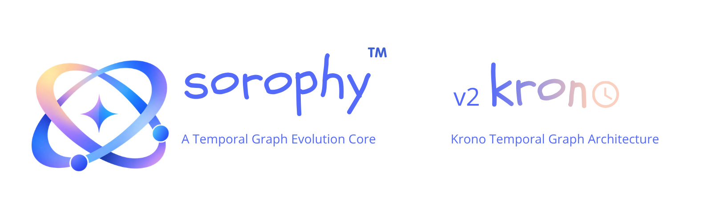

<div align="center">


<p>introduces</p>



<h1>Sorophy v2.0.0 — Krono</h1>

<p>
<strong>A Temporal Graph Evolution Core</strong>
</p>

<p>
Entities · Relationships · Typed Values · Time · Events · Evolution · History · Snapshots · TQD · Graph Diff · Serialization
</p>

<br/>

<p align="center">
  <a href="https://github.com/Phantom-Con-Artist/Sorophy"></a>&nbsp;
  <a href="https://github.com/Phantom-Con-Artist/Sorophy/releases"></a>&nbsp;
  <a href="LICENSE"></a>
</p>

<p align="center">
  <a href="https://dotnet.microsoft.com/"></a>&nbsp;
  <a href="https://learn.microsoft.com/en-us/dotnet/csharp/"></a>&nbsp;
  <a href="CHANGELOG.md"></a>
</p>

<p>
<strong>✓ 2.0.0 · Stable S · Krono</strong><br/>
Krono is the stable second-generation Sorophy architecture: a structural engine for temporal information, explicit graph evolution, historical state, point-in-time projection, temporal querying, and deterministic structural comparison.
</p>

</div>

---

<div align="center">

### Build information into structure.  
### Give structure a memory.

</div>

Sorophy.Engine is the foundational engine of **The Saga**, a general-purpose structured information ecosystem designed to represent things, describe them, connect them, preserve their state, and provide applications with explicit temporal structure.

Version 1.0 established the stable graph foundation.

**Sorophy v2.0.0 "Krono"** extends that foundation with semantic time, temporal relationship validity, passive Event Entities, explicit Evolution operations, immutable historical facts, point-in-time Snapshots, the Temporal Query Domain (TQD), and Graph Diff.

> **Information should be structured with Time.**

The central architectural boundary is simple:

```text
Applications understand meaning.
Sorophy understands structure.
```

Applications decide what a domain event means and which structural changes represent it. Sorophy provides the primitives, invariants, temporal model, evolution machinery, history, and projections needed to represent those changes without silently erasing the past.

---

# ✦ Table of Contents

- [What Is Krono?](#-what-is-krono)
- [Stable Status](#-stable-status)
- [From V1 to Krono](#-from-v1-to-krono)
- [The Saga](#-the-saga)
- [Core Concepts](#-core-concepts)
- [Entity Model](#-entity-model)
- [Event Entities](#-event-entities)
- [Relationships](#-relationships)
- [Temporal Model](#-temporal-model)
- [Relationship Evolution](#-relationship-evolution)
- [Historical State](#-historical-state)
- [Snapshots](#-snapshots)
- [Temporal Query Domain](#-temporal-query-domain)
- [Graph Diff](#-graph-diff)
- [Canonical and Derived State](#-canonical-and-derived-state)
- [Serialization](#-serialization)
- [Validation and Reliability](#-validation-and-reliability)
- [Testing & Verification](#-testing--verification)
- [Potential Applications](#-potential-applications)
- [What Sorophy.Engine Is Not](#-what-sorophyengine-is-not)
- [Documentation](#-documentation)
- [Development](#-development)
- [Branch and Release Model](#-branch-and-release-model)
- [Design Principles](#-design-principles)
- [Roadmap](#-roadmap)
- [Beyond Krono](#-beyond-krono)
- [Contributing](#-contributing)
- [Community](#-community)
- [License](#-license)
- [The Philosophy](#-the-philosophy)
- [Author](#-author)

---

# ✦ What Is Krono?

**Sorophy v2.0.0 "Krono"** is the second major architectural stage of Sorophy.Engine and the reference implementation of the temporal portion of **The Saga Architecture**.

Krono retains the explicit primitives of V1:

```text
SorophyValue
      ↓
SorophyProperty
      ↓
SorophyEntity
      ↓
SorophyRelationship
      ↓
SorophyGraph
```

and adds temporal state and controlled evolution:

```text
                         Time
                          │
                          ▼
Entity ───── Relationship ───── Graph
                  │
                  ▼
              Evolution
                  │
                  ▼
               History
                  │
                  ▼
          Temporal Projections
          ├── Snapshot
          ├── TQD
          └── Graph Diff
```

The purpose is not to turn every object into a database record.

The purpose is to make **meaningful temporal change representable without destroying the state that came before it**.

Krono therefore keeps these concepts distinct:

```text
Entity
    = what exists

Relationship
    = how things are connected

Temporal Model
    = where a state exists in time

Event Entity
    = a passive entity representing an occurrence

Evolution
    = a declared structural state transition

Executor
    = the explicit mechanism that applies a transition

History
    = immutable prior relationship state

Snapshot
    = point-in-time structural projection

TQD
    = read-only temporal query surface

Graph Diff
    = structural comparison between snapshots
```

---

# ✦ Stable Status

## Sorophy Engine v2.0.0 — Krono

```text
Version:          2.0.0
Codename:         Krono
Stability:        Stable S
Standard:         Gold Standard
Framework:        .NET 10
License:          AGPL-3.0-or-later
```

Krono's stable release verification includes:

```text
769 / 769 unit test cases passing
0 failed
0 skipped

13 / 13 stress campaigns passing
58 / 58 stress checks passing
```

The release verification program includes deterministic unit coverage, adversarial testing, metamorphic testing, persistence and serialization checks, temporal reconstruction, Snapshot/TQD/Graph Diff coverage, cross-feature chaos, endurance testing, and cross-platform persistence verification.

The stability profile is intentionally separate from a raw quality score:

> **Stable S is a stability profile. It is not a claim that the engine is universally perfect or that every possible application domain has been validated.**

---

# ✦ From V1 to Krono

V1 established the durable structural graph:

```text
V1.0.0
│
├── Entities
├── Relationships
├── Typed Values
├── Graph Storage
├── Traversal
├── Indexing
├── Serialization
├── Storage
└── Adversarial Verification
```

Krono preserves that foundation and adds:

```text
Krono
│
├── Expanded Entity Model
├── Semantic Time
├── Relationship Validity
├── Event Entities
├── Relationship Evolution
├── Historical Facts
├── Relationship History
├── Relationship Identity Retirement
├── Point-in-Time Snapshots
├── Temporal Query Domain
├── Graph Diff
├── .lore v2
└── Cross-Platform Verification
```

The conceptual shift is:

```text
V1

"What exists?"
"How are things connected?"


Krono

"What exists?"
"How are things connected?"
"When is this state valid?"
"What changed?"
"When did it change?"
"What was true before?"
"What does the graph look like at T?"
"What changed between T1 and T2?"
```

**V2 does not replace the graph model. It gives the graph a memory and a temporal coordinate.**

---

# ✦ The Saga

<div align="center">


</div>

**The Saga is an open-source initiative for building structured information systems whose underlying information can outlive any single application.**

The fundamental idea is:

> **Information should be represented as structured, interconnected objects rather than being trapped inside isolated documents.**

A person may exist in one record.  
A location may exist in another.  
The relationship between them may exist only as a sentence in a third document.

The Saga approaches that problem from another direction.

Instead of beginning with documents, it begins with **structure**.

```text
                         THE SAGA
                            │
              ┌─────────────┴─────────────┐
              │                           │
      Structured Information         Applications
              │                           │
              │                ┌──────────┼──────────┐
              │                │          │          │
              ▼                ▼          ▼          ▼
          Sorophy            Orbpad     Editors    Tools
              │
              ▼
        Entities + Relationships
              │
              ▼
             Graph
```

The application is replaceable.

**The information is not.**

---

# ✦ Core Concepts

Sorophy.Engine is intentionally built from a small set of explicit primitives.

## `SorophyGraph`

`SorophyGraph` is the canonical owner of active graph state.

It maintains:

- Entities
- Relationships
- Connectivity
- Graph invariants
- Traversal structures
- Supporting indexes
- Relationship histories
- Retired relationship identities

Conceptually:

```text
SorophyGraph
│
├── Entities
│   ├── Entity A
│   ├── Entity B
│   └── Entity C
│
├── Relationships
│   ├── A → B
│   ├── B → C
│   └── A → C
│
└── Relationship Histories
    ├── Relationship X
    └── Relationship Y
```

The implementation uses partial classes to organize the code. Conceptually and publicly, it remains one graph.

---

## `SorophyValue`

`SorophyValue` is the strongly typed value container.

Supported value categories include:

```text
Null
Boolean
Integer
Decimal
String
Guid
DateTime
List
Object
```

The engine preserves the distinction between values such as:

```csharp
new SorophyValue(
    SorophyValueType.Integer,
    42L);
```

and:

```csharp
new SorophyValue(
    SorophyValueType.String,
    "42");
```

Lists and objects are recursively cloned when required for isolation.

---

## `SorophyProperty`

A property is structured information attached to an entity or relationship:

```text
Name
Value
```

The value is represented by `SorophyValue`, rather than an arbitrary string bag.

---

# ✦ Entity Model

An entity is an independently identifiable object.

Conceptually:

```text
SorophyEntity
├── Id
├── Name
├── Type
├── Description
├── Properties
├── Tags
├── Documents
└── OccurredAt
```

`Type` is a semantic classifier rather than a rigid inheritance hierarchy.

Examples:

```text
Character
Location
Organization
Project
Document
Dataset
Event
```

Applications can define their own vocabulary without requiring a new engine subclass for every domain object.

### Entity lifecycle

The frozen Krono lifecycle is:

```text
Creation
   ↓
Property / Tag / Document Mutation
   ↓
Termination / Removal
```

A direct:

```csharp
graph.AddEntity(entity);
```

creates a **baseline object**. Krono does not fabricate a creation timestamp or historical fact for it.

---

# ✦ Event Entities

An Event is an ordinary `SorophyEntity` whose type identifies it as an event:

```text
SorophyEntity
Type = "Event"
OccurredAt = T
```

Events are **first-class, passive temporal anchors**.

They:

- carry descriptive information;
- carry an authoritative `OccurredAt`;
- may anchor one or many relationship evolutions;
- may be used by TQD for provenance queries;
- do not execute themselves;
- are not workflow objects;
- are not normal relationship endpoints.

There is deliberately no:

```text
event.Execute()
```

The lifecycle is explicit:

```text
Event Entity
     │
     │ represents an occurrence
     ▼
Evolution Operation
     │
     │ declares structural change
     ▼
Evolution Executor
     │
     │ applies change
     ▼
SorophyGraph
```

Applications provide the domain semantics.

Krono provides the structural operation.

### Event time is authoritative

When an evolution is anchored by an Event Entity:

```text
Event.OccurredAt
        ↓
Evolution temporal coordinate
```

The architecture does not invent a second conflicting temporal coordinate.

Multiple Event Entities may share the same `OccurredAt`. They are temporally equivalent. Krono does **not** infer causal ordering or precedence between co-temporal events.

---

# ✦ Relationships

A relationship is a first-class directed connection:

```text
Entity (Source)
      │
      ▼
Relationship
      │
      ▼
Entity (Target)
```

A relationship contains:

```text
Id
SourceId
TargetId
Type
Properties
ValidFrom
ValidTill
```

Normal relationships always connect normal entities.

```text
Entity → Relationship → Entity
```

An Event Entity is not automatically an edge endpoint.

Referential integrity requires both endpoints to exist before a relationship is added.

Self-links are permitted.

---

# ✦ Temporal Model

Krono introduces first-class semantic time through `SorophyTime`.

```text
SorophyTime
│
├── Schema
├── Temporal Unit
├── Position
└── Precision
```

A temporal schema can represent domains such as:

```text
Year / Month / Day
Era / Age / Year
Phase / Cycle / Tick
Domain-specific timelines
```

The engine does not assume that every domain uses the same calendar.

### Strict comparison

Krono deliberately avoids guessed conversions.

Temporal comparison requires:

```text
Same Schema
     +
Same Unit
     +
Numeric Position
```

Numeric positions use arbitrary-precision integers.

Cross-schema or cross-unit comparison fails explicitly rather than guessing a conversion.

Named, ordinal, and pattern-based positions are valid temporal structures but do not provide numeric ordering.

---

## Relationship Validity

A relationship state may carry:

```text
ValidFrom = T1
ValidTill = T2
```

This answers:

> When is this relationship state semantically valid?

That is different from:

```text
At
```

which answers:

> At what temporal coordinate was this historical state recorded?

Therefore:

```text
ValidFrom / ValidTill ≠ At
```

This distinction is fundamental to Krono.

---

# ✦ Relationship Evolution

Krono provides five explicit relationship evolution operations:

```text
Creation
Property Modification
Type Change
Validity Change
Termination
```

The architecture separates describing a transition from applying it:

```text
SorophyRelationshipEvolution
             │
             ▼
SorophyRelationshipEvolutionExecutor
             │
             ▼
        SorophyGraph
```

## Creation

Introduces a new relationship identity.

The initial state is captured as a historical fact at the evolution's temporal coordinate.

## Property Modification

Sets, replaces, or removes relationship properties.

The complete prior relationship state is captured before mutation.

## Type Change

Changes the relationship type while preserving relationship identity.

```text
Before:
A ──knows──> B

Evolution @ T50

After:
A ──hates──> B
```

The prior state remains in history.

## Validity Change

Updates `ValidFrom` and/or `ValidTill` while enforcing temporal compatibility.

## Termination

Removes the relationship from the active graph and permanently retires its identity.

```text
Active
  ↓
Termination @ T100
  ↓
Inactive
  ↓
Relationship ID Retired
```

The final state is captured before termination.

---

# ✦ Historical State

Krono distinguishes:

```text
SorophyRelationshipFact
SorophyRelationshipHistory
```

A fact is an immutable representation of a relationship state:

```text
SorophyRelationshipFact
├── At
├── RelationshipId
├── SourceId
├── TargetId
├── Type
├── Properties
├── ValidFrom
├── ValidTill
└── EventEntityId
```

A history is the append-only collection belonging to one relationship identity:

```text
Relationship X
     │
     └── History
          ├── Fact @ T1
          ├── Fact @ T2
          ├── Fact @ T3
          └── ...
```

Historical facts cannot be edited, reordered, or deleted through the history API.

### Current state vs historical state

```text
Current State
    = mutable

Historical State
    = append-only

Relationship Identity
    = persistent
```

History is relationship-centric rather than a global unstructured mutation log.

---

# ✦ Relationship Identity Retirement

Relationship identities are never silently recycled.

```text
Created
   ↓
Active
   ↓
Evolved
   ↓
Terminated
   ↓
Retired
```

Once an ID is retired:

```csharp
graph.AddRelationship(...)
```

and relationship creation evolution cannot reuse that identity.

Ordinary removal and evolutionary termination remain distinct:

```text
graph.RemoveRelationship(id)
    → removes active state
    → retires identity
    → does not fabricate history

SorophyRelationshipTermination
    → records final fact
    → removes active state
    → retires identity
```

Historical facts remain available after retirement.

---

# ✦ Snapshots

Snapshots are read-only, point-in-time structural projections of the graph.

```csharp
ISorophySnapshot snapshot =
    graph.CreateSnapshot(targetTime);
```

An Event Entity can also provide the temporal coordinate:

```csharp
ISorophySnapshot snapshot =
    graph.CreateSnapshot(eventEntity);
```

The Event overload validates that the entity is an Event with a non-null `OccurredAt`, then delegates to the temporal snapshot operation.

### Materialization

Snapshot materialization:

1. clones entities;
2. recursively clones nested properties, tags, and documents;
3. reconstructs relationship state from canonical state and history;
4. excludes relationships that did not yet exist;
5. excludes terminated relationships after termination;
6. prunes dangling edges;
7. produces isolated read-only state.

### Post-transition semantics

Snapshots are **inclusive/post-transition** projections.

If a transition occurs exactly at `T`:

```text
Snapshot(T)
    =
state after transitions effective at T
```

An Event at `T` therefore produces the same temporal projection as a direct snapshot at `T`:

```text
Snapshot(Event)
    ==
Snapshot(Event.OccurredAt)
```

Multiple events at the same temporal coordinate are temporally equivalent. Snapshotting does not invent causal order.

---

# ✦ Temporal Query Domain

The **Temporal Query Domain (TQD)** is the read-only temporal query surface:

```text
graph.TemporalQuery
        │
        ▼
ITemporalQueryDomain
```

TQD operates over graph state, temporal history, and provenance.

### Point-in-time

```text
At(time)
At(eventEntity)

EntityExistsAt(...)
GetEntityAt(...)

RelationshipExistsAt(...)
GetRelationshipAt(...)

GetOutboundRelationshipsAt(...)
GetInboundRelationshipsAt(...)
```

### Interval and history

```text
GetFactsInInterval(...)
GetModifiedRelationshipIds(...)
GetRelationshipFactsInInterval(...)
GetRelationshipHistory(...)
```

### Provenance

```text
GetFactsByEvent(...)
GetRelationshipsEvolvedByEvent(...)
```

### Deterministic result ordering

TQD uses deterministic presentation ordering:

```text
Facts:
    At ascending
    → RelationshipId ascending
    → insertion index ascending

Relationship IDs:
    Guid ascending
```

This is a presentation guarantee.

It does **not** imply causal precedence between co-temporal transitions.

TQD is intentionally not:

- a mutation API;
- an event-sourcing system;
- a causal inference engine;
- a natural-language query language;
- a multi-hop reasoning framework.

---

# ✦ Graph Diff

`SorophyGraphDiff` provides deterministic structural comparison between snapshots.

```csharp
var changes = SorophyGraphDiff.Compare(
    before,
    after);
```

There is also an extension form:

```csharp
var changes = before.Diff(after);
```

Graph Diff identifies:

```text
Entities
├── Added
├── Removed
└── Modified

Relationships
├── Added
├── Removed
└── Modified
```

Entity modification considers:

```text
Name
Type
OccurredAt
Description
Tags
Documents
Properties
```

Relationship modification considers:

```text
Type
ValidFrom
ValidTill
Properties
```

### State diff, not history diff

Graph Diff compares endpoint states.

It does **not** reconstruct every intermediate transition.

For example:

```text
T1 ──────────────── T2

Entity deleted
Entity recreated identically
```

If the final states are structurally identical, Graph Diff reports no change.

Intermediate transition analysis belongs to TQD and relationship history.

### Deterministic output

Change collections are ordered by canonical `Guid` ascending.

Graph Diff does not infer:

- causality;
- semantic intent;
- event ordering;
- multi-hop effects;
- patches;
- merges;
- undo operations.

It is deliberately a foundation-level structural diff.

---

# ✦ Canonical and Derived State

Krono maintains a strict distinction between canonical truth and derived acceleration structures.

```text
CANONICAL STATE
│
├── Entities
├── Relationships
├── Relationship Histories
└── Retired Relationship IDs


DERIVED / SUPPORTING STATE
│
├── Tag Index
├── Relationship Index
├── Adjacency Chains
└── Adjacency Slab Pool
```

Canonical state is authoritative.

Derived structures exist for efficient access and can be rebuilt from canonical state.

```text
Canonical State
      │
      ├──────────────► Derived Indexes
      │
      └──────────────► Projections
                       ├── Snapshot
                       ├── TQD
                       └── Graph Diff
```

Derived state is never the source of truth.

---

# ✦ Serialization

Sorophy uses dedicated structured representations:

```text
.entity
    = individual entity

.lore
    = connected graph
```

Krono's `.lore` format is version 2.

A v2 document contains the conceptual structures:

```json
{
  "formatVersion": 2,
  "entities": [],
  "relationships": [],
  "relationshipHistories": [],
  "retiredRelationshipIds": []
}
```

Historical facts may contain:

```text
At
RelationshipId
SourceId
TargetId
Type
Properties
ValidFrom
ValidTill
EventEntityId
```

### Persistence principles

- Canonical state is serialized.
- Derived indexes are rebuilt.
- Historical facts are persisted explicitly.
- Retired relationship IDs are persisted explicitly.
- `EventEntityId` is persisted when present.
- Existing history is serialized as-is.
- Serialization never fabricates missing history.
- Deserialization does not execute evolution.
- Output is deterministic.
- Numeric serialization is culture invariant.
- Persistence is validated across supported platforms.

```text
Deserialize ≠ Execute
```

---

# ✦ Validation and Reliability

Krono validates structural integrity both eagerly and through explicit graph validation.

Important invariants include:

- valid entity identifiers;
- valid relationship identifiers;
- referential integrity;
- relationship endpoint existence;
- temporal schema consistency;
- historical fact integrity;
- Event provenance validity;
- retired identity separation;
- tag-index consistency;
- adjacency consistency;
- persistence integrity.

For Event provenance:

```text
EventEntityId
      │
      ├── must exist
      ├── must not be empty
      └── must identify an Event Entity
```

Corrupted canonical state is rejected rather than silently repaired.

---

# ✦ Testing & Verification

Krono is hardened with deterministic, adversarial, metamorphic, cross-feature, endurance, and persistence testing.

<div align="center">

### 🧪 769 / 769 test cases passing

**0 failed · 0 skipped**

</div>

```text
Unit Test Cases
    769 / 769 passed

Stress Campaigns
    13 / 13 passed

Stress Checks
    58 / 58 passed
```

The verification program covers:

```text
V1 Graph Foundation
Entity Model
Relationships
Referential Integrity
Indexing
Adjacency
Typed Values
Temporal Core
Relationship Validity
Evolution
History
Provenance
Identity Retirement
Persistence
Snapshots
TQD
Graph Diff
Metamorphic Properties
Determinism
Corruption Rejection
Cross-Feature Chaos
Randomized Adversarial Workloads
Large History / Endurance
Cross-Platform Portability
```

The test strategy intentionally includes ugly cases:

```text
Missing entities
Duplicate IDs
Invalid temporal schemas
Retired ID reuse
Dangling provenance
Malformed persistence
Same-time transitions
Boundary times
Deep nested values
Repeated reconstruction
Large histories
Repeated serialization
Cross-platform artifacts
```

---

# ✦ Potential Applications

Sorophy is deliberately domain-neutral.

Potential applications include:

- **Worldbuilding and Fiction** — characters, kingdoms, lineages, treaties, wars, and eras.
- **Knowledge Management** — explicit typed relationships between concepts, documents, and references.
- **Research and Scientific Information** — datasets, instruments, samples, and observations.
- **Historical and Archival Systems** — territories, alliances, offices, and institutional change.
- **Project and Organizational Systems** — teams, resources, dependencies, and reorganizations.
- **Games and Simulations** — world state and evolving relationships.
- **Structured Documentation** — dependencies, versions, architecture, and change.
- **Domain-specific information systems** — any application requiring structured interconnected state.

---

# ✦ What Sorophy.Engine Is Not

Sorophy.Engine is intentionally **not**:

- a graphical editor;
- a complete worldbuilding application;
- a database server;
- a cloud platform;
- a UI framework;
- a game engine;
- a general-purpose ORM;
- an AI assistant;
- a workflow engine;
- an event-sourcing framework.

It is a:

> **Temporal Graph Evolution Core for structured information.**

---

# ✦ Documentation

| Document | Purpose |
|---|---|
| [`ARCHITECTURE.md`](docs/ARCHITECTURE.md) | Engine boundaries and major subsystems |
| [`ENTITY_MODEL.md`](docs/ENTITY_MODEL.md) | Entity architecture and lifecycle |
| [`LORE_MODEL.md`](docs/LORE_MODEL.md) | `.lore` graph model and relationship semantics |
| [`TEMPORAL_MODEL.md`](docs/TEMPORAL_MODEL.md) | `SorophyTime`, schemas, units, validity, and temporal rules |
| [`EVENTS_AND_EVOLUTION.md`](docs/EVENTS_AND_EVOLUTION.md) | Event Entities and relationship evolution |
| [`HISTORY.md`](docs/HISTORY.md) | Historical facts, history, and identity retirement |
| [`SNAPSHOT.md`](docs/SNAPSHOT.md) | Point-in-time graph snapshots |
| [`TQD.md`](docs/TQD.md) | Temporal Query Domain |
| [`GRAPH_DIFF.md`](docs/GRAPH_DIFF.md) | Structural graph comparison |
| [`SERIALIZATION.md`](docs/SERIALIZATION.md) | `.entity` / `.lore` persistence semantics |
| [`TESTING.md`](docs/TESTING.md) | Testing and verification |
| [`ROADMAP.md`](docs/ROADMAP.md) | Current roadmap and future directions |
| [`CHANGELOG.md`](CHANGELOG.md) | Release history |

---

# ✦ Development

Clone the repository:

```bash
git clone https://github.com/Phantom-Con-Artist/Sorophy.git
cd Sorophy
```

Switch to the stable Krono line:

```bash
git switch v2.0.0-Stable
```

Build:

```bash
dotnet build
```

Run tests:

```bash
dotnet test
```

Inspect stress campaigns:

```bash
dotnet run --project Sorophy.Engine.StressTests -- list
```

Build Release:

```bash
dotnet build -c Release
```

Pack:

```bash
dotnet pack -c Release
```

---

# ✦ Branch and Release Model

```text
v1.0.0-stable
      │
      └── Sorophy V1 stable line

v2.0.0-Stable
      │
      └── Sorophy v2.0.0 "Krono"
           └── Stable S · Gold Standard
```

V2 is a major architectural evolution rather than a minor extension of the V1 API.

---

# ✦ Design Principles

1. **Structure over convenience** — Preserve semantic data types.
2. **Explicit invariants** — Invalid states should fail explicitly.
3. **Time is first-class** — Temporal coordinates belong in the model.
4. **Validity is not recording time** — Keep `ValidFrom`/`ValidTill` distinct from `At`.
5. **Events are passive** — Events describe occurrences; they do not execute.
6. **Explicit execution** — Evolutions describe; executors apply.
7. **History is append-only** — Previous relationship states are not silently erased.
8. **Identity is persistent** — Retired relationship identities cannot be recycled.
9. **Canonical state is truth** — Derived indexes are accelerators, not authority.
10. **Projections are read-only** — Snapshot, TQD, and Diff do not mutate the graph.
11. **Applications own semantics** — The engine does not infer domain meaning or causality.
12. **Round-trip fidelity matters** — Persistence preserves structure and typing.
13. **Determinism matters** — Equivalent inputs should produce stable observable results.
14. **Test the ugly cases** — Adversarial verification is part of the architecture.

---

# ✦ Roadmap

## ✅ Completed in Krono

- Core graph with referential integrity, adjacency, and indexes
- Expanded Entity Model
- Tags and embedded entity documents
- Semantic temporal model
- Relationship validity
- Event Entities
- Relationship Evolution
- Historical Facts and Relationship History
- Relationship identity retirement
- Point-in-time Snapshots
- Temporal Query Domain
- Graph Diff
- `.lore` v2 persistence
- Validation hardening
- Cross-platform persistence verification
- Adversarial and metamorphic hardening
- Endurance verification

## Beyond the Current Foundation

Possible directions include:

- Event orchestration packages
- State reconstruction and replay tooling
- Advanced graph algorithms
- Broader temporal analysis
- Domain adapters
- Whimsy / NLP
- Additional Saga ecosystem services

These are deliberately **directions rather than commitments**.

Future capabilities will be evaluated against the existing Krono architecture, invariants, and design principles. The roadmap will be updated when principles and designs for those capabilities are sufficiently mature to integrate cleanly with the architecture.

Until then, post-v2 items should be treated as **possibilities rather than promises**.

---

# ✦ The Completion Philosophy

```text
Represent structured information
            ↓
Connect that information
            ↓
Represent meaningful temporal state
            ↓
Apply explicit state transitions
            ↓
Preserve historical relationship state
            ↓
Project the graph at a point in time
            ↓
Query temporal structure
            ↓
Compare structural states
```

A few strong primitives that work together form an engine.

A collection of loose shortcuts does not.

---

# ✦ Contributing

Contributions, issues, and discussions are welcome.

When reporting bugs, include:

- Sorophy.Engine version;
- .NET version and OS;
- minimal reproduction steps;
- expected vs. actual behavior;
- relevant stack traces.

For architectural proposals, describe:

- the use case;
- affected invariants;
- architectural boundary;
- expected interaction with canonical state;
- expected persistence implications.

---

# ✦ Community

<div align="center">

<a href="https://discord.com/invite/Em2ur4J8PF">
  
</a>

</div>

---

# ✦ License

Sorophy.Engine is licensed under the **GNU Affero General Public License v3.0 or later (AGPL-3.0-or-later)**.

See [`LICENSE`](LICENSE) for the full license text.

---

# ✦ The Philosophy

<div align="center">

### Don't build another place to store information.

### Build a system that understands what the information is.

<br/>

### Don't let change destroy meaning.

### Represent the state.

### Represent the transition.

### Preserve the history.

<br/>

### Information should be structured with Time.

</div>

---

# ✦ Author

<div align="center">

<h2>Subhradeep Sarkar</h2>

<p>Creator and maintainer of Sorophy Engine</p>

<p align="center">
  
</p>

<p>
<a href="mailto:personalsarkar345@gmail.com">
  
</a>
&nbsp;
<a href="https://www.linkedin.com/in/subhradeepcs">
  
</a>
&nbsp;
<a href="https://subhradeepsarkarportfolio.pages.dev/">
  
</a>
&nbsp;
<a href="https://discord.com/invite/Em2ur4J8PF">
  
</a>
</p>

</div>

---

<div align="center">

<br/>

<strong>Sorophy v2.0.0 — Krono</strong>

<br/>

A Temporal Graph Evolution Core

<br/><br/>

Structured information. Connected by design. Aware of change.

<br/><br/>

© 2026 <strong>Subhradeep Sarkar</strong>. Sorophy.Engine is licensed under the GNU Affero General Public License v3.0 or later. See `LICENSE` for details.

</div>
